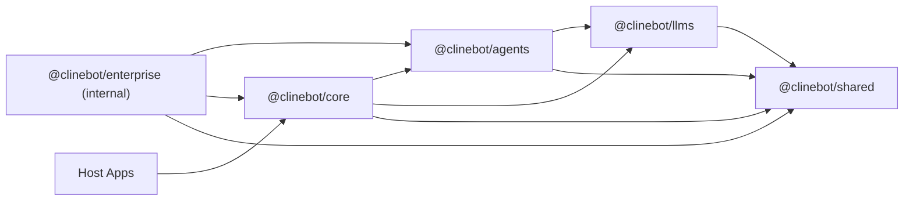

# Cline SDK Architecture

This document is the architecture source of truth for the repository.

It focuses on:

- package boundaries
- dependency direction
- runtime flows
- design constraints

It is not the main onboarding guide and it is not the detailed API reference.

## Layered Model

The workspace is organized as a layered runtime stack.

## Package Responsibilities

### `@clinebot/shared`

Owns reusable low-level contracts and infrastructure:

- shared types and schemas
- path resolution
- hook contracts/engine
- extension registry contracts
- prompt and parsing helpers
- storage path helpers

Design rule:

- `shared` should not depend on higher-level runtime packages.

### `@clinebot/llms`

Owns model/provider runtime concerns:

- provider settings/config resolution
- model catalogs and manifests
- shared gateway-style provider contracts
- handler creation via an internal gateway registry
- AI SDK-backed provider execution code

Design rule:

- provider-specific behavior should be isolated here, not spread across `core` or apps.

### `@clinebot/agents`

Owns the stateless runtime loop:

- agent iteration loop
- tool orchestration
- runtime event emission
- hook/extension execution
- turn preparation before provider calls
- in-memory team/runtime primitives

Design rule:

- `agents` should not own persistent storage or host lifecycle concerns.

### `@clinebot/core`

Owns stateful orchestration:

- runtime composition
- session lifecycle
- storage and persistence
- config watching/loading and watcher projections
- settings listing and mutation orchestration
- default host tool assembly
- plugin discovery/loading
- default context compaction policy
- telemetry integration
- hub server and scheduled-runtime services under `src/hub/`
- hub discovery, the detached hub daemon, and the `@clinebot/core/hub/daemon-entry` subpath
- host-side hub client adapters (`NodeHubClient`, `HubSessionClient`, `HubUIClient`, `connectToHub`) exported from `@clinebot/core/hub`

Design rules:

- `core` is the app-facing orchestration layer over `agents`.
- hub-related modules live under `packages/core/src/hub/`, grouped by service:
  - `client/` contains host-facing hub clients and browser connection helpers
  - `daemon/` contains detached daemon startup, entrypoint, and local runtime handler wiring
  - `discovery/` contains endpoint defaults, discovery records, and workspace owner resolution
  - `runtime-host/` contains `RuntimeHost` adapters for shared local hub and remote hub routing
  - `server/` contains role-named WebSocket server startup, native/browser socket adapters, server transport, notifications, session projection, client contribution proxy adapters, schedule-event mapping, and `handlers/` for hub command dispatch
  - `shared/` contains sparse pure helpers used across hub roles
- settings mutations belong in core services and hub commands, not in host-specific file writes. Hosts should call the core settings facade or the `settings.*` hub command family and react to `settings.changed`.

### `@clinebot/enterprise`

Internal-only enterprise integration layer:

- enterprise identity adapters
- enterprise control-plane sync
- enterprise token/bundle storage
- managed rule/workflow/skill materialization
- claims-to-role mapping
- enterprise telemetry normalization and core bridge helpers

Design rules:

- `enterprise` may depend on `core`
- `core` must not depend on `enterprise`
- enterprise stays optional and internal to this repo

## Runtime Flows

### Local In-Process Runtime

1. Host constructs a `RuntimeHost` through `@clinebot/core`.
2. `@clinebot/core` selects `LocalRuntimeHost` through `packages/core/src/runtime/host/host.ts`.
3. Hosts normalize config into transport-safe `RuntimeSessionConfig` plus explicit `localRuntime` bootstrap fields before calling `RuntimeHost.startSession(...)`.
4. `@clinebot/core` prepares a local bootstrap artifact from those named local fields, then builds the runtime from it.
5. `@clinebot/core` creates an `Agent` from `@clinebot/agents`.
6. `@clinebot/agents` runs the loop using `@clinebot/llms` handlers.
7. `@clinebot/core` persists state, artifacts, and metadata.

### Hub-Backed Runtime

1. Host constructs a `RuntimeHost` through `@clinebot/core`.
2. `@clinebot/core` selects `HubRuntimeHost` or `RemoteRuntimeHost` through `packages/core/src/runtime/host/host.ts`.
3. When no compatible local hub is already discovered, `@clinebot/core` can spawn a detached hub daemon and reconnect through discovery.
4. Hosts attach and detach from shared sessions without stopping the authority runtime, so another client can keep streaming or resume the same session later.
5. The hub-hosted runtime executes the agent loop using `@clinebot/agents` and `@clinebot/llms`.
6. `@clinebot/core` hub services broker sessions, events, approvals, schedules, and client-owned runtime contributions such as session-local tool executors, custom tools, hooks, checkpoints, compaction, mistake-limit decisions, and instruction services.
7. Hub event forwarding preserves structured streaming lifecycle boundaries: text/reasoning deltas, final text/reasoning completion, tool start/finish, and agent done events are translated across the hub transport so host UIs can reliably close loading/streaming state.
8. Hub client adapters exported from `@clinebot/core/hub` (`NodeHubClient`, `HubSessionClient`, `HubUIClient`, `connectToHub`) translate command/reply and event streams into host-facing APIs.

Local hub discovery also carries the authentication contract for the shared
daemon. On startup, the hub server generates a cryptographically random
per-process auth token, stores it in the owner discovery record, and writes that
record with owner-only file permissions. Local clients resolve the token from
the discovery file at connection time rather than embedding it in endpoint URLs.
The server validates the token with a constant-time comparison before accepting
`/hub` WebSocket upgrades or `/shutdown` requests; WebSocket clients send it via
the `Sec-WebSocket-Protocol` header and shutdown requests use an
`Authorization: Bearer` header. Unauthenticated local processes can still probe
public health/build metadata, but they cannot attach to sessions, issue
commands, or stop the daemon.

### Interactive CLI Startup

1. `apps/cli` owns OpenTUI startup and must render the first frame without waiting for detached hub startup.
2. Interactive sessions use `backendMode: "auto"` so an already-compatible hub can be reused immediately, while a missing hub is only prewarmed in the background and the TUI falls back to a local runtime for responsiveness.
3. Hub-required flows such as `clite hub`, schedules, connectors, and `--zen` may still call the explicit ensure path because those commands require a live hub before proceeding.
4. Resume hydration is deferred until after `renderOpenTui()` so loading previous messages cannot block initial TUI paint.
5. Any future CLI/TUI startup work should follow the same rule: daemon startup, discovery polling, provider catalog refreshes, file indexing, and resume reads must be background or user-action gated unless a command explicitly requires their result before output.

### Enterprise-Managed Runtime

1. Enterprise bootstrap resolves identity through an `IdentityAdapter`.
2. Enterprise fetches a normalized `EnterpriseConfigBundle`.
3. Enterprise caches the token and bundle through enterprise stores.
4. Enterprise materializes managed rules/workflows/skills under workspace-local `.cline/<plugin>/`.
5. Enterprise optionally derives telemetry config or telemetry services.
6. Hosts pass the prepared result into `@clinebot/core` through the generic `prepare` hook.
7. Enterprise applies extensions and telemetry through explicit `localRuntime` bootstrap fields, not the transport-safe `RuntimeSessionConfig`.
8. `@clinebot/core` consumes the prepared local overrides during local bootstrap.

This keeps enterprise-specific behavior above the published orchestration layer.

## Design Seams

The codebase relies on a few repeated seams instead of one-off integration paths.

### Config Watchers

Core uses file-based discovery and watchers for:

- rules
- workflows
- skills
- agents
- hooks
- plugins

Design implications:

- additional instruction sources should usually materialize into files and reuse watcher-based loading instead of inventing parallel in-memory execution paths.
- in `packages/core`, config-facing discovery, parsing, watching, and slash-command projection live under `src/extensions/config`

### Runtime Builder Inputs

`DefaultRuntimeBuilder` composes a runtime from generic inputs:

- tools
- hooks
- extensions
- user instruction watcher
- telemetry

Design implications:

- higher-level integrations should prefer feeding those inputs rather than patching agent internals directly.
- the local runtime bootstrap lives in `packages/core/src/services/local-runtime-bootstrap.ts` and feeds the builder rather than bypassing it

### Runtime Host Boundary

Core exposes one shared execution boundary: `RuntimeHost`.

Concrete implementations:

- `LocalRuntimeHost` for in-process execution
- `HubRuntimeHost` for shared local hub execution
- `RemoteRuntimeHost` for explicit remote hub endpoints

Design implications:

- host selection happens in `packages/core/src/runtime/host/host.ts`
- `ClineCore` delegates uniformly to `RuntimeHost` and does not branch on local vs hub behavior
- transport-specific translation belongs inside concrete hosts, not in top-level orchestration
- `RuntimeHost` uses runtime-primitive method names (`startSession`,
  `runTurn`, `restoreSession`, `getSession`, `listSessions`, `stopSession`,
  `deleteSession`, `readSessionMessages`, `dispatchHookEvent`) while
  `ClineCore` keeps the app-facing product API (`start`, `send`, `restore`,
  `get`, `list`, `stop`, `delete`, `readMessages`, `ingestHookEvent`).
- `RuntimeHost` inputs stay transport-safe, while `ClineCore.start(...)` is the app-facing facade that normalizes broad local config before delegation
- `RuntimeSessionConfig` is transport-neutral across local, shared hub, and remote hub modes; host-local bootstrap concerns stay under named `localRuntime` fields rather than a broad override bag
- pending prompt list/update/delete are exposed through the grouped
  `ClineCore.pendingPrompts` service. Accumulated usage lookup and
  active-session model switching are also service-style capabilities exposed
  through `ClineCore` when the concrete transport implements them. These
  service APIs are intentionally outside the minimal `RuntimeHost` primitive
  vocabulary.
- client-local runtime behaviors are expressed as `RuntimeCapabilities` on
  `ClineCoreOptions` / `StartSessionInput`; local hosts invoke those handlers
  directly, while hub/remote hosts advertise the same handlers and proxy hub
  `capability.requested` / `approval.requested` events back through core
- for hub/remote sessions, advertised client-local capabilities are owned by the
  client that created or restored the runtime session. Other clients may attach
  as participants/observers, but capability requests remain routed by
  `sessionId` to the original capability-owner `targetClientId`; response
  handlers reject replies from non-owner clients. Hub cancellation paths publish
  cancelled `capability.resolved` events so the owner can abort long-running
  prompt handlers while preserving the proxied `ToolContext.conversationId`.
- client-local runtime behavior uses one contribution model across local and
  hub/remote modes. The client builds a serializable `clientContributions`
  manifest plus a local handler table from the same tools, hooks, and runtime
  services it would register in-process. Local mode calls those handlers
  directly. Hub/remote mode sends only the manifest to the authority runtime,
  which installs normal runtime proxy contributions and invokes the original
  client handlers through named `capability.request` calls. The proxy translates
  transport, not behavior; tool executors, custom `extraTools`, lifecycle hooks,
  custom checkpoint creation, custom compaction, consecutive-mistake decisions,
  and user-instruction services follow this same path. Tool progress flows back
  through `capability.progress`, so `onChange` / `emitUpdate` remains on the
  normal SDK tool-event path instead of requiring a side channel.
- app-facing `defaultToolExecutors` and top-level `requestToolApproval`
  inputs are not part of the runtime capability contract; integrations provide
  `capabilities.toolExecutors` and `capabilities.requestToolApproval`.
  Internal local runtime builder wiring uses `toolExecutors`, so
  default-executor vocabulary is not a feature channel.

### Session State Services

Core-owned services hold session behaviors that must stay consistent across
transport-specific host implementations:

- pending prompt / turn queue semantics live in
  `packages/core/src/runtime/turn-queue/pending-prompt-service.ts`; local and hub
  paths adapt to the same queue operations instead of each defining queue rules;
  the queue service owns the semantics while runtime hosts only expose internal
  routing adapters for list/update/delete/drain and apps use
  `ClineCore.pendingPrompts`;
- checkpoint restore/fork planning is centralized in
  `packages/core/src/session/session-versioning-service.ts`, which validates the
  target checkpoint, applies workspace restore when requested, builds restored
  session start input, retains checkpoint refs, and returns source/restored
  canonical snapshots;
- canonical session projection lives in
  `packages/core/src/session/session-snapshot.ts` as `CoreSessionSnapshot` plus
  `createCoreSessionSnapshot(...)`.

Design implications:

- runtime hosts should route commands/events and adapt protocol payloads, while
  queue/checkpoint/snapshot semantics stay in shared core services;
- canonical snapshots are the target shape for local and hub event/reply
  surfaces, so integrations should avoid adding feature-specific session shapes
  unless a storage boundary requires one.

### Settings Mutation Boundary

Core owns settings snapshots and mutations through `packages/core/src/settings`.
The hub exposes the same path through `settings.list` and `settings.toggle`.

Design implications:

- hosts should not mutate skill, tool, MCP, provider, or other settings files directly
- domain-specific persistence helpers, such as skill markdown frontmatter writes, stay internal to the owning settings provider/service
- successful hub-backed mutations return an updated settings snapshot and publish `settings.changed` with the changed settings types
- CLI settings surfaces may keep local snapshot rendering for startup responsiveness, but mutation flow must refresh the relevant watcher before reloading UI data

## Logging

Cross-package logging uses a small injected interface exported from `@clinebot/shared`:

- **`BasicLogger`** — required `debug` and `log`; optional `error`. Hosts map these to their backend (Pino, VS Code `OutputChannel`, etc.). Many runtime options take `logger?: BasicLogger`; when omitted, components skip logging or use `noopBasicLogger` where a full object is required.
- **`BasicLogMetadata`** — optional structured fields (`sessionId`, `runId`, `providerId`, `toolName`, `durationMs`, …) plus `severity` on `log` when a single method must represent both informational and warning-style messages (for example the CLI Pino bridge maps `severity: "warn"` to Pino `warn`).

Naming clarity:

- **`CliLoggerAdapter` (CLI)** — a **host bundle**: holds the raw `pino` logger (for file paths, rotation, and CLI-only concerns) and exposes `.core: BasicLogger` for anything that consumes the SDK contract. It is not an `ITelemetryAdapter`.
- **`TelemetryLoggerSink` (`@clinebot/core`)** — an **`ITelemetryAdapter`** that mirrors telemetry events and metrics into a `BasicLogger`. It is a telemetry sink, not a host logging implementation.

The agent and other call sites route `info` / `warn`-style semantics through `log` (warnings include `severity: "warn"` in metadata). Errors prefer `error` when implemented; otherwise `log` with `severity: "error"` is used as a fallback.

### Session Startup Bootstrap

`ClineCore.create(...)` exposes a generic `prepare(input)` hook.

Design implications:

- higher-level packages can prepare workspace-scoped runtime state before a session starts
- core stays unaware of enterprise-specific contracts
- cleanup stays at the host boundary rather than inside the agent loop

### Storage Adapters

Stateful persistence should be isolated behind adapter/service layers.

Design implications:

- file-backed, SQLite-backed, RPC-backed, and enterprise-specific persistence should share service logic where possible and isolate backend differences in adapters.

### Extension and Hook System

Extensibility is split deliberately:

- extensions register runtime contributions
- hooks intercept lifecycle stages

Design implications:

- additive runtime behavior should usually enter through these extension points instead of bespoke host-specific code.

### Context Compaction

Context compaction is owned by `core`.

- `@clinebot/agents` owns the generic turn-preparation seam:
  - run normal lifecycle hooks
  - allow hosts to rewrite message history or system prompt before the provider call
- `@clinebot/core` owns compaction policy:
  - inject a prepare-turn pipeline for root sessions
  - run registered message builders and API-safe message normalization before gateway model calls
  - choose between built-in strategies through a registry map
  - keep compaction logic out of the low-level agent message builder

Design implications:

- compaction is a context-pipeline concern owned by `core`
- `agents` stays focused on the stateless loop and provider/tool orchestration
- delegated/subagent flows should inherit compaction behavior through core session config, not through a separate agent-level compaction hook surface

### Extension Layering Inside Core

`packages/core/src/extensions` is split by concern:

- `extensions/config`: config loaders, parsers, watchers, and watcher projections such as runtime slash-command expansion
- `extensions/plugin`: runtime plugin discovery, loading, and sandboxing
- `extensions/context`: core-owned context/message pipeline concerns such as compaction

Design implications:

- avoid mixing config discovery code into runtime/plugin code
- avoid creating thin runtime wrapper files when a helper is fundamentally projecting watcher state

## Architectural Constraints

### Keep `agents` Stateless

Do not move these concerns into `@clinebot/agents`:

- session persistence
- provider settings storage
- RPC lifecycle
- host-specific approvals
- enterprise policy caching

### Keep `core` Generic

Do not make `@clinebot/core` enterprise-specific.

If a capability is truly generic, add a generic seam to core. If it is enterprise-specific, keep it in `@clinebot/enterprise`.

### Use One-Way Optional Layers

Optional higher-level integrations may depend on lower layers.
Lower layers should not depend on optional feature packages.

That rule is what keeps:

- `enterprise -> core` acceptable
- `core -> enterprise` unacceptable

## Internal Enterprise Design

`@clinebot/enterprise` integrates with core through three main entrypoints:

- `prepareEnterpriseRuntime(...)`
- `prepareEnterpriseCoreIntegration(...)`
- `createEnterprisePlugin(...)`

Preferred bridge:

- `prepareEnterpriseCoreIntegration(...)`

Why:

- it prepares and materializes enterprise-managed files under `.cline/<plugin>/`
- it returns a valid `AgentPlugin`
- it can create a telemetry service from enterprise telemetry settings
- it lets core consume enterprise behavior through existing generic seams and normal watcher discovery

## File-Based and Event-Driven Automation (`ClineCore` / `CronService`)

`@clinebot/core` ships a file-based automation subsystem under
`packages/core/src/cron/`. It lets operators author recurring and one-off
tasks as Markdown files under global `~/.cline/cron/` by default, and
event-driven tasks as `events/*.event.md` specs. All trigger kinds run
through the same durable queue and runtime handlers. `ClineCore` exposes the
SDK-facing `cline.automation.*` entry points; `CronService` is the internal
orchestrator used by core and hub layers.

### Layers

1. **Spec parser** (`cron/specs/cron-spec-parser.ts`): parses YAML frontmatter + body
   into a `CronSpec` discriminated union (`one_off | schedule | event`).
   Types live in `@clinebot/shared` under `src/cron/cron-spec-types.ts`
   so other packages can consume them without the YAML parser. Schedule
   expressions and timezones are validated before a spec can become
   runnable.
2. **Store** (`cron/store/sqlite-cron-store.ts`): owns `cron.db` at
   `resolveCronDbPath()` (default `.cline/data/db/cron.db`). Schema is
   bootstrapped from `cron/store/cron-schema.ts` — sessions and cron live in separate
   DBs so their lifecycles stay decoupled.
3. **Reconciler** (`cron/specs/cron-reconciler.ts`): scans the configured cron specs
   directory (global `~/.cline/cron/` by default, or workspace-scoped when
   configured), parses each file independently, and upserts spec state.
   Invalid specs are recorded
   with `parse_status='invalid'` so state is durable rather than silently
   dropped. Files that disappear between scans get `removed=1` and their
   queued runs are cancelled.
4. **Watcher** (`cron/specs/cron-watcher.ts`): `node:fs watch({ recursive: true })`
   with a ~250ms per-path debounce. Watcher events always trigger a
   re-reconcile — the reconciler is always the source of truth, not the
   watcher stream.
5. **Materializer** (`cron/runner/cron-materializer.ts`): turns file-triggered specs into
   queued `cron_runs`. One-off: at most one run record per `(spec_id,
   revision)`, including failed runs so specs do not retry accidentally.
   Schedule: "one overdue catch-up on startup then advance" using
   timezone-aware `getNextCronTime`.
6. **Event ingress** (`cron/events/cron-event-ingress.ts`): accepts already-normalized
   `AutomationEventEnvelope` values, persists them into `cron_event_log`,
   matches enabled event specs by `event_type` plus declarative filters,
   applies dedupe/debounce/cooldown policy, and enqueues `cron_runs` with
   `trigger_kind='event'`. It never executes agents directly. Plugins can
   declare `automationEvents` and submit normalized events through
   `ctx.automation.ingestEvent(...)`; sandboxed plugins forward those events
   through the core plugin event bridge.
7. **Runner** (`cron/runner/cron-runner.ts`): polls `cron.db`, atomically claims
   queued runs, executes them via the existing `HubScheduleRuntimeHandlers`
   (`startSession` → `sendSession` → `stopSession` / `abortSession`),
   renews the run claim while execution is active, writes a markdown report
   per run, and transactionally updates status. File specs can constrain
   tool availability, config extension loading (`rules`, `skills`,
   `plugins`), session source, and a notes directory that is injected into
   the system prompt. Event runs include the normalized trigger event context
   in the prompt.
8. **Reports** (`cron/reports/cron-report-writer.ts`): writes
   `.cline/cron/reports/<run-id>.md` with run frontmatter plus
   `## Summary`, `## Usage`, `## Tool Calls`, and, for event runs,
   `## Trigger Event` sections.
9. **Service** (`cron/service/cron-service.ts`): orchestrates all of the above.
   `ClineCore.create({ automation })` owns the SDK-facing lifecycle and exposes
   `cline.automation.*` methods. Hub-side callers can submit normalized events
   through the `cron.event.ingest` command.

The detached hub daemon passes its workspace root as `cronOptions`, so
normal CLI/hub startup watches `${workspaceRoot}/.cline/cron/` without a
custom host needing to opt in.

Programmatic hub schedules are stored as `cron_specs` with source
`hub-schedule` and execute through the same `cron_runs`
claim/requeue/report flow as file-backed one-off, recurring, and
event-driven specs. The hub schedule command surface remains a thin adapter;
there is no separate schedules table, schedule store, or schedule runner.

## Publishability Constraint

This repo has both publishable SDK packages and internal workspace packages.

Architectural consequence:

- internal packages must not accidentally become part of the publishable SDK surface
- release automation should only target the intended published packages
- internal code may compose with published packages, but published packages should not take hard dependencies on internal-only workspace layers unless you explicitly intend to publish that integration
