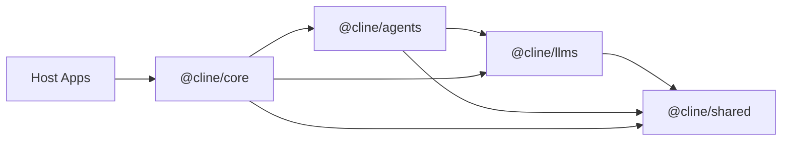

# Cline SDK Architecture

This document is the architecture source of truth for the Cline SDK repository. It describes how the system is organized, how components interact, and the design principles that guide development decisions.

**Who should read this?**
- SDK contributors working across multiple packages
- Developers building integrations or host applications using `@cline/core`
- Plugin authors understanding the runtime and extension systems

**What this covers:**
- Package boundaries and responsibilities
- Dependency direction and layering rules
- Runtime flows (local, hub-backed, remote-config managed)
- Design seams (repeated patterns instead of one-off integrations)
- Architectural constraints and why they exist

**What this is NOT:**
- An onboarding guide for new contributors (see README.md and CONTRIBUTING.md)
- A detailed API reference (see package READMEs and inline JSDoc)
- A user guide (see the main documentation)

## Layered Model

The workspace is organized as a layered runtime stack.

```mermaid
flowchart LR
  shared["@cline/shared"]
  llms["@cline/llms"]
  agents["@cline/agents"]
  core["@cline/core"]
  apps["Host Apps"]

  llms --> shared
  agents --> llms
  agents --> shared
  core --> agents
  core --> llms
  core --> shared
  apps --> core
```

## Package Responsibilities

### `@cline/shared`

Owns reusable low-level contracts and infrastructure:

- shared types and schemas
- path resolution
- hook contracts/engine
- extension registry contracts
- prompt and parsing helpers
- storage path helpers
- remote-config schemas, managed instruction materialization, telemetry normalization, and blob upload primitives

Design rule:

- `shared` should not depend on higher-level runtime packages.

### `@cline/llms`

Owns model/provider runtime concerns:

- provider settings/config resolution
- model catalogs and manifests
- shared gateway-style provider contracts
- handler creation via an internal gateway registry
- AI SDK-backed provider execution code

Design rule:

- provider-specific behavior should be isolated here, not spread across `core` or apps.

### `@cline/agents`

Owns the stateless runtime loop:

- agent iteration loop
- tool orchestration
- runtime event emission
- hook/extension execution
- turn preparation before provider calls
- in-memory team/runtime primitives

Design rule:

- `agents` should not own persistent storage or host lifecycle concerns.

### `@cline/core`

Owns stateful orchestration:

- runtime composition
- session lifecycle
- storage and persistence
- config watching/loading and watcher projections
- settings listing and mutation orchestration
- default host tool assembly
- plugin discovery/loading
- default context compaction policy
- telemetry integration
- hub server and scheduled-runtime services under `src/hub/`
- hub discovery, the detached hub daemon, and the `@cline/core/hub/daemon-entry` subpath
- host-side hub client adapters (`NodeHubClient`, `HubSessionClient`, `HubUIClient`, `connectToHub`) exported from `@cline/core/hub`

Design rules:

- `core` is the app-facing orchestration layer over `agents`.
- hub-related modules live under `packages/core/src/hub/`, grouped by service:
  - `client/` contains host-facing hub clients and browser connection helpers
  - `daemon/` contains detached daemon startup, entrypoint, and local runtime handler wiring
  - `discovery/` contains endpoint defaults, discovery records, and workspace owner resolution
  - `server/` contains WebSocket server startup, native/browser socket adapters, server transport, server helpers, and `handlers/` for hub command dispatch
- settings mutations belong in core services and hub commands, not in host-specific file writes. Hosts should call the core settings facade or the `settings.*` hub command family and react to `settings.changed`.

## Runtime Flows

### Local In-Process Runtime

1. Host constructs a `RuntimeHost` through `@cline/core`.
2. `@cline/core` selects `LocalRuntimeHost` through `packages/core/src/runtime/host.ts`.
3. Hosts normalize broad local config into `RuntimeSessionConfig` plus `localRuntime` overrides before calling `RuntimeHost.start(...)`.
4. `@cline/core` prepares a local bootstrap artifact from `localRuntime`, then builds the runtime from it.
5. `@cline/core` creates an `Agent` from `@cline/agents`.
6. `@cline/agents` runs the loop using `@cline/llms` handlers.
7. `@cline/core` persists state, artifacts, and metadata.

Completion telemetry is anchored to the assistant's explicit completion
declaration, not session shutdown. After each agent turn, the local
runtime inspects `AgentResult.toolCalls` and emits `task.completed` the
moment a successful `submit_and_exit` (the SDK analog of original
Cline's `attempt_completion`) is observed. A single teardown choke
point (`emitTaskCompletedOnTeardown(...)`) retains a fallback emission
for sessions whose final turn finished cleanly without an explicit
completion-tool observation (non-interactive runs not using the yolo
preset, or hosts that disable `submit_and_exit`). It is invoked from
every session exit path — both `shutdownSession(...)` and
`releaseSessionRuntime(...)` — so the emission never depends on which
teardown branch a stop routes through. Each session emits at most one
`task.completed`. See `DOC.md` for the event payload and `source`
field.

### Hub-Backed Runtime

1. Host constructs a `RuntimeHost` through `@cline/core`.
2. `@cline/core` selects `HubRuntimeHost` or `RemoteRuntimeHost` through `packages/core/src/runtime/host.ts`.
3. When no compatible local hub is already discovered, `@cline/core` can spawn a detached hub daemon and reconnect through discovery.
4. Hosts attach and detach from shared sessions without stopping the authority runtime, so another client can keep streaming or resume the same session later.
5. The hub-hosted runtime executes the agent loop using `@cline/agents` and `@cline/llms`.
6. `@cline/core` hub services broker sessions, events, approvals, schedules, and client-owned runtime capabilities such as session-local tool executors.
7. Hub event forwarding preserves structured streaming lifecycle boundaries: text/reasoning deltas, final text/reasoning completion, tool start/update/finish, and agent done events are translated across the hub transport so host UIs can reliably close loading/streaming state. `run.started` is emitted only after the target session is resolved and carries the originating command's `requestId` and `clientId`, allowing multi-client hosts to correlate delivery acknowledgments.
8. Hub client adapters exported from `@cline/core/hub` (`NodeHubClient`, `HubSessionClient`, `HubUIClient`, `connectToHub`) translate command/reply and event streams into host-facing APIs.
9. Hub `session.get` records include both canonical root-session usage and explicit aggregate usage from the hub-owned `RuntimeHost`, so attached clients can intentionally render either root-only or root-plus-teammate costs without replaying event streams.

Session status is reported, never fabricated. A session's initial status
reflects whether a turn actually runs inside `start(...)`: prompt-bearing
starts (one-shot or interactive) begin `running`, interactive starts without a
prompt begin `idle` until their first turn, and resumed sessions report their
persisted status. Each turn owns its `running` → `idle` transition. On the
client side, `HubRuntimeHost` projects a status event only when the hub
session record or the session snapshot actually carries one; snapshot-only
`session.updated` events (asynchronous persistence updates, which can trail a
turn's final idle update) report the snapshot's real status. Hosts that gate
workspace-wide operations on busy sessions (for example the desktop's
checkpoint-restore gate) depend on this: a defaulted `running` with no owning
turn leaves such gates blocked with nothing to clear them.

Command progress follows the same runtime event boundary as other agent output.
Shell executors emit structured stdout/stderr chunks through
`AgentToolContext.emitUpdate`; the agent runtime projects them as tool
`content_update` events, and the Hub publishes them as `tool.updated` with the
session, tool-call, and tool identifiers intact. Hub clients reconstruct the
tool update for their host-facing event stream. Client-contributed executors
must forward capability progress through this same path rather than creating a
host-specific side channel. The built-in shell executor coalesces output on a
short interval and bounds each stream's pending tail before it enters the event
pipeline; consumers independently coalesce and cap their rendered scrollback.

Proceed-while-running is an explicit command lifecycle, separate from client
or session detachment. A shell process advertises detachability only after it
has spawned and registered with the host-scoped command execution controller.
The client sends `run.proceed_while_running` with the owning `sessionId` and,
when available, `toolCallId`; the Hub delegates to the authoritative
`RuntimeHost`, which releases every matching registered process from the tool
call. The executor removes its abort and timeout ownership, resolves the tool
call with the current bounded output and a temporary log path, and continues
draining the process into that log. Detached logs are size-capped, retained for
a bounded inspection window after the command exits, and then their temporary
directories are removed. Every process that constructs a `LocalRuntimeHost`
starts one detached-log reconciliation: it reaps completed logs outside the
retention window, reschedules retained logs, and follows active detached-command
identities until they exit, so cleanup does not depend on timers from the process
that launched the command. Hub daemons and direct embedders therefore share the
same detachment and restart lifecycle instead of relying on a daemon-specific
entrypoint. Active-command markers pair the PID with a process-generation start
token, preventing an unrelated process that later reuses the PID from extending
the log lifetime. Completion markers distinguish a live, possibly silent command
from a completed log. Process probes distinguish an absent process from an
unavailable identity provider. Transient probe failures retain the active marker
and are never treated as evidence of command completion. Reconciliation keeps
the advertised log and retries until the provider can prove that the original
process still exists, its PID belongs to a replacement process, or the process
is absent. A host exit alone never starts the retention window for a surviving
command; the replacement host continues polling the process identity and begins
retention only after the command ends. During persistent provider unavailability,
the capped log may outlive the normal retention window because preserving a
potentially live command's advertised path takes precedence over guessing that
it exited. A detached client connection alone never changes process ownership or
command execution.

### Generated Media Operation and Event Flow

Model modalities and provider operations are separate facts. Modalities describe
values a model accepts or produces; the explicit operation selects the provider
transport. Language models keep the normal agent loop even when they can emit
media, while `operation: "image-generation"` selects `generateImage` and
`operation: "transcription"` selects a declared speech-to-text transport.
Operation-specific execution variants such as recorded and realtime
transcription live in `operationModes`, not in the generic capability list.
Specialized operations fail closed unless the provider manifest and adapter
both implement them, so an OpenAI-compatible chat endpoint never implies an
image, audio, transcription, or video endpoint.

Generated media crosses package boundaries as follows:

1. `@cline/llms` validates provider output once and creates canonical
   `GeneratedMedia` values. The contract carries a stable ID, modality, MIME type,
   and a discriminated base64, HTTP(S), or artifact source. Current producers emit
   images; audio, video, and large artifact-backed files use the same contract.
2. Provider model tools are adapters, not raw AI SDK tools. An adapter owns its
   native result projection into canonical media. The generic stream layer
   coalesces preliminary or repeated results, enforces the per-turn media budget,
   and persists only a compact activity summary rather than duplicating base64 in
   model-tool metadata.
3. `@cline/agents` appends media events at their exact stream position in the
   assistant message. That message is the canonical replay and persistence source;
   observational provider-tool activity remains display-only metadata.
4. `@cline/core` projects live media as `content_end(media)`. The hub publishes
   `assistant.media`, preserving the same media ID, and clients deduplicate live
   and hydrated content by that ID.
5. Web clients share `GeneratedMediaContent` from `@cline/ui` for image, audio,
   video, file, and unavailable-source rendering. Inline bytes are exposed only
   through short-lived browser-owned object URLs; remote and artifact sources
   require a client-owned trusted resolver. CLI and ACP clients provide
   transport-appropriate materialization or fallback output without changing
   the canonical message.

Image-edit inference is intentionally local: when a dedicated image model accepts
image input and the current user message has no explicit image, only an image on
the immediately preceding assistant message is reused. Older images are not
implicitly attached across intervening turns.

Session history provenance keeps the client surface and initiation mode separate.
`StartSessionInput.source` identifies the client (`vscode`, `desktop`, `cli`,
`core`, and so on), while top-level `StartSessionInput.mode` identifies how the
session began (`user`, `automation`, `subagent`, or `team`). The persisted messages
envelope records both values, along with client version and child-session
lineage. Missing initiation mode defaults to `user`; automation runtime adapters
must pass `mode: "automation"` explicitly.

Root-session persistence is lazy. Starting a runtime allocates its session ID
and keeps configuration or seeded history in memory, but does not create a
database row, manifest, or messages artifact. The first accepted user turn
persists that same ID and its artifacts. Closing a runtime before a user turn
therefore leaves no empty history entry, and persistence code never allocates a
replacement ID for an unknown session.

Workspace bootstrap is owned by the runtime that executes the session. Hub
clients preserve an omitted `cwd` and `workspaceRoot` across the transport so
the hub-side execution host can place the session in the shared chat
workspace on its own filesystem at
`<cline-data-dir>/workspaces/chat` (by default
`~/.cline/data/workspaces/chat`). The chat workspace is seeded with an
`AGENTS.md` rules file that tells the agent to treat the session as a chat
and to create a named project folder only when the user asks for one.
The resolved paths are returned in the session snapshot and are the source of
truth for client-side manifests; transport clients must not invent a local path
for a remote runtime.

Detached daemon startup retries transient `ETXTBSY` spawn failures before
polling discovery. This covers package-manager updates that replace the CLI
binary immediately before a command restarts the shared hub.

Local hub discovery also carries the authentication contract for the shared
daemon. On startup, the hub server generates a cryptographically random
per-process auth token, stores it in the owner discovery record, and writes that
record with owner-only file permissions. Local clients resolve the token from
the discovery file at connection time rather than embedding it in endpoint URLs.
The server validates the token with a constant-time comparison before accepting
`/hub` WebSocket upgrades or `/shutdown` requests; WebSocket clients send it via
the `Sec-WebSocket-Protocol` header and shutdown requests use an
`Authorization: Bearer` header. Unauthenticated local processes can still probe
public health/build metadata, but they cannot attach to sessions, issue
commands, or stop the daemon.

Local hub rediscovery is limited to managed shared-daemon endpoints obtained
through discovery or `ensure*HubServer(...)` startup paths. Managed local hubs
must match both the supported wire protocol and the current Hub build identity;
a protocol-compatible daemon from another build is retired before its
replacement starts so upgrades cannot keep executing stale runtime code. SDK
builds embed a deterministic fingerprint of the runtime sources, package
manifests, build configuration, and dependency lock, so the identity changes
with the executable Hub code even before package versions are bumped. Builds
also embed a build epoch that orders them in time: when the fingerprints
differ, a managed Hub produced *after* the client's own build is reused over
the compatible wire protocol instead of being retired (replacing it would
downgrade the daemon), and the client's build-mismatch watcher prompts the
user to update and restart. Hubs that are older, unordered, or missing build
metadata are retired and replaced as before, so two concurrently running
installations converge on the newest build instead of repeatedly replacing
each other's daemons.
Explicit endpoints, including loopback URLs such as
`ws://127.0.0.1:<port>/hub`, are sticky exact targets and remain protocol-only:
reconnects may retry the same socket URL, but command recovery and
startup-deadlock recovery must not replace them with the workspace-discovered
hub. This keeps custom local hubs and remote hubs from silently drifting to a
different process.

### Interactive CLI Startup

1. `apps/cli` owns OpenTUI startup and must render the first frame without waiting for detached hub startup.
2. Interactive sessions use `backendMode: "auto"` so an already-compatible hub can be reused immediately, while a missing hub is only prewarmed in the background and the TUI falls back to a local runtime for responsiveness.
3. Hub-required flows such as `cline hub`, schedules, connectors, and `--zen` may still call the explicit ensure path because those commands require a live hub before proceeding.
4. Resume hydration is deferred until after `renderOpenTui()` so loading previous messages cannot block initial TUI paint.
5. Any future CLI/TUI startup work should follow the same rule: daemon startup, discovery polling, provider catalog refreshes, file indexing, and resume reads must be background or user-action gated unless a command explicitly requires their result before output.

### Connector Persistence and Recovery

1. `@cline/shared/db` owns the low-level SQLite connector store and the one-time legacy JSON import.
2. Dashboard configuration and CLI connection state are recorded separately. Configuration edits replace only dashboard-owned connector and security flags in stored reconnect arguments, preserving CLI-only runtime options, and refresh arguments only for connectors that have previously started successfully.
3. `@cline/core` owns connector autostart persistence and reconnect orchestration. The detached hub daemon is the sole startup reconnect owner, preventing dashboard startup from racing it and launching duplicate processes.
4. Detached connector starts are persisted only after a child process is created. Internal detached children preserve that state when they exit, while a clean user-interactive exit disables autostart.
5. CLI and dashboard hosts pass their connector CLI launch specification through the detached process environment. The package-owned daemon entrypoint uses that specification to start connector reconnect wrappers without importing application code.
6. The detached hub entrypoint exposes `hubDaemonReady`, which resolves only after the WebSocket server is listening. It begins reconnect attempts after signaling readiness, and reconnect failures remain best-effort rather than taking down the hub.

### Remote-Config Managed Runtime

1. A host or core wrapper fetches a normalized `RemoteConfigBundle`.
2. `@cline/shared/remote-config` caches the bundle when configured.
3. Shared remote-config materializes managed rules/workflows/skills under workspace-local `.cline/<plugin>/`.
4. Shared remote-config derives generic OpenTelemetry config and session blob upload metadata from the bundle.
5. `@cline/core` exposes the app-facing integration wrapper that applies extensions, telemetry, and session metadata to `StartSessionInput`.
6. `@cline/core` consumes the prepared local overrides during local bootstrap.

This keeps reusable remote-config behavior in `shared` while the session-specific bridge remains in `core`.

## Design Seams

The codebase relies on a few repeated seams instead of one-off integration paths.

### 1. Config Watchers

Core uses file-based discovery and watchers for:

- rules
- workflows
- skills
- agents
- hooks
- plugins

Design implication:

- new instruction sources should usually materialize into files and reuse watcher-based loading instead of inventing parallel in-memory execution paths.
- in `packages/core`, config-facing discovery, parsing, watching, and slash-command projection live under `src/extensions/config`

### 2. Runtime Builder Inputs

`DefaultRuntimeBuilder` composes a runtime from generic inputs:

- tools
- hooks
- extensions
- user instruction watcher
- telemetry

Design implication:

- higher-level integrations should prefer feeding those seams rather than patching agent internals directly.
- the local runtime bootstrap lives in `packages/core/src/services/local-runtime-bootstrap.ts` and feeds the builder rather than bypassing it

### 3. Runtime Host Boundary

Core exposes one shared execution boundary: `RuntimeHost`.

Concrete implementations:

- `LocalRuntimeHost` for in-process execution
- `HubRuntimeHost` for shared local hub execution
- `RemoteRuntimeHost` for explicit remote hub endpoints

Design implication:

- host selection happens in `packages/core/src/runtime/host.ts`
- `ClineCore` delegates uniformly to `RuntimeHost` and does not branch on local vs hub behavior
- transport-specific translation belongs inside concrete hosts, not in top-level orchestration
- `RuntimeHost` inputs stay transport-safe, while `ClineCore.start(...)` is the app-facing facade that normalizes broad local config before delegation
- `RuntimeSessionConfig` is transport-neutral across local, shared hub, and remote hub modes; host-local bootstrap concerns stay under `localRuntime`
- client-local runtime behaviors that must survive hub mode, such as `defaultToolExecutors`, are attached at session start and proxied through hub capability requests instead of changing host selection
- pending prompt list/update/delete are exposed through the grouped
  `ClineCore.pendingPrompts` service. Usage summary lookup and active-session
  model switching are also service-style capabilities exposed through
  `ClineCore` when the concrete transport implements them. These service APIs
  are intentionally outside the minimal `RuntimeHost` primitive vocabulary.
- The usage service's `getAccumulatedUsage(sessionId)` method returns a summary
  with two explicit buckets: `usage` for the root/lead agent and
  `aggregateUsage` for root plus teammates/subagents. Local execution tracks
  root usage and teammate usage as separate buckets, then derives aggregate
  totals from those buckets while telemetry remains scoped to the primary
  lead/root agent.

### 4. Settings Mutation Boundary

Core owns settings snapshots and mutations through `packages/core/src/settings`.
The hub exposes the same path through `settings.list` and `settings.toggle`.

Design implication:

- hosts should not mutate skill, tool, MCP, provider, or other settings files directly
- domain-specific persistence helpers, such as skill markdown frontmatter writes, stay internal to the owning settings provider/service
- successful hub-backed mutations return an updated settings snapshot and publish `settings.changed` with the changed settings types
- CLI settings surfaces may keep local snapshot rendering for startup responsiveness, but mutation flow must refresh the relevant watcher before reloading UI data

### 5. Session Startup Bootstrap

`ClineCore.create(...)` exposes a generic `prepare(input)` hook.

Design implication:

- higher-level packages can prepare workspace-scoped runtime state before a session starts
- core stays unaware of enterprise-specific contracts
- cleanup stays at the host boundary rather than inside the agent loop

### 6. Logging

Cross-package logging uses a small injected interface exported from `@cline/shared`:

- **`BasicLogger`** — required `debug` and `log`; optional `error`. Hosts map these to their backend (Pino, VS Code `OutputChannel`, etc.). Many runtime options take `logger?: BasicLogger`; when omitted, components skip logging or use `noopBasicLogger` where a full object is required.
- **`BasicLogMetadata`** — optional structured fields (`sessionId`, `runId`, `providerId`, `toolName`, `durationMs`, …) plus `severity` on `log` when a single method must represent both informational and warning-style messages (for example the CLI Pino bridge maps `severity: "warn"` to Pino `warn`).

Naming clarity:

- **`CliLoggerAdapter` (CLI)** — a **host bundle**: holds the raw `pino` logger (for file paths, rotation, and CLI-only concerns) and exposes `.core: BasicLogger` for anything that consumes the SDK contract. It is not an `ITelemetryAdapter`.
- **`TelemetryLoggerSink` (`@cline/core`)** — an **`ITelemetryAdapter`** that mirrors telemetry events and metrics into a `BasicLogger`. It is a telemetry sink, not a host logging implementation.

The agent and other call sites route former `info` / `warn` semantics through `log` (warnings include `severity: "warn"` in metadata). Errors prefer `error` when implemented; otherwise `log` with `severity: "error"` is used as a fallback.

Design implication:

- logging is injectable and transport-agnostic, allowing host environments (CLI, VS Code, browser) to wire their own backends
- do not hardcode logging calls; accept a `logger?: BasicLogger` parameter instead

### 7. Storage Adapters

Stateful persistence should be isolated behind adapter/service layers.

Design implication:

- file-backed, SQLite-backed, RPC-backed, and enterprise-specific persistence should share service logic where possible and isolate backend differences in adapters.

### 8. Extension and Hook System

Extensibility is split deliberately:

- extensions register runtime contributions
- hooks intercept lifecycle stages

Design implication:

- additive runtime behavior should usually enter through these extension points instead of bespoke special-case host code.

### 9. Context Compaction

Context compaction is owned by `core`.

- `@cline/agents` owns the generic turn-preparation seam:
  - run normal lifecycle hooks
  - allow hosts to project message history or system prompt before the provider call
  - keep its canonical runtime transcript append-only when a projection is returned
- `@cline/core` owns compaction policy:
  - inject a prepare-turn pipeline for root sessions
  - choose between built-in strategies through a registry map
  - persist the latest compacted working context as a session compaction artifact
  - keep compaction logic out of the low-level agent message builder

Design implications:

- compaction is a context-pipeline concern owned by `core`
- canonical session history lives in the session messages artifact at full fidelity; compaction state lives separately in `${sessionId}.compaction.json`
- resume loads the canonical transcript for history/debugging and, when present, reuses the latest compaction state only after validating a hash of the canonical prefix covered by that state; valid state is projected by appending canonical messages written after the compaction boundary
- sessions that were already persisted with compacted messages before this model are best-effort only because the omitted original transcript is not recoverable from the compacted artifact
- `agents` stays focused on the stateless loop and provider/tool orchestration
- delegated/subagent flows should inherit compaction behavior through core session config, not through a separate agent-level compaction hook surface

### 10. Extension Layering Inside Core

`packages/core/src/extensions` is split by concern:

- `extensions/config`: config loaders, parsers, watchers, and watcher projections such as runtime slash-command expansion
- `extensions/plugin`: runtime plugin discovery, loading, and sandboxing
- `extensions/context`: core-owned context/message pipeline concerns such as compaction

Design implications:

- avoid mixing config discovery code into runtime/plugin code
- avoid creating thin runtime wrapper files when a helper is fundamentally projecting watcher state

Sandboxed plugin subprocesses are session-local but lazily recreatable. Core
reclaims a sandbox after 30 minutes without an in-flight RPC call (configurable
through `PluginSandboxOptions.idleTimeoutMs` or
`CLINE_PLUGIN_IDLE_TIMEOUT_MS`), and the next plugin call starts and
reinitializes it transparently. Pending requests are associated with the child
generation that owns them so an old process exiting cannot reject work sent to
its replacement. The bootstrap also exits when its parent IPC channel
disconnects. The parent is the single authority for idle shutdown so competing
deadlines cannot terminate a child while the parent is dispatching new work.

Design implications:

- sandbox process count scales with recently active sessions, not every session
  observed since hub startup
- eviction never interrupts an in-flight plugin call
- in-process plugin state is ephemeral across idle eviction; durable plugin
  state belongs in persistent storage
- a sandbox must never outlive its owning hub process

## Architectural Constraints

### Keep `agents` Stateless

Do not move these concerns into `@cline/agents`:

- session persistence
- provider settings storage
- RPC lifecycle
- host-specific approvals
- remote-config policy caching

### Keep `core` Generic

Do not make `@cline/core` organization- or provider-specific.

If a capability is truly generic and app-facing, add a generic core seam. Reusable remote-config parsing, materialization, and upload primitives belong in `@cline/shared/remote-config`.

### Use One-Way Optional Layers

Optional higher-level integrations may depend on lower layers.
Lower layers should not depend on optional feature packages.

For remote config, that means shared owns the reusable bundle/materialization/blob primitives and core owns only the session-oriented wrapper exported to apps.

## Hub-Owned Agenda Task Queue

Agenda tasks are durable proposals for future work. They are intentionally
separate from cron specs, queued prompts inside an existing session, and the
agent-team task board. Shared, browser-safe contracts use `AgendaTaskRecord`
and `AgendaTaskRunRecord`; orchestration and persistence remain in
`@cline/core`.

> **Status:** the agent-facing `kind: "todo"` half of the `tasks` tool and the
> desktop Agenda UI are temporarily disabled while the Agenda UX is reworked
> (`AGENDA_TODO_TOOL_ENABLED` in `hub-server-transport.ts` and
> `AGENDA_UI_ENABLED` in the desktop webview). The backend described below —
> the manager, storage, `task.*` Hub commands, and desktop plumbing — stays
> fully wired, and the schedule kind remains active.

### Authority and persistence

- A Hub process owns one Agenda task manager. Its
  `AgendaTaskManagerApi` boundary is the only place allowed to change task
  lifecycle, approval, run, or session-link state. Hub commands, file import,
  and the agent tool all route mutations through that boundary.
- User-editable intent is represented as Markdown with YAML frontmatter in
  `~/.cline/tasks/*.task.md` for global tasks and
  `<workspace>/.cline/tasks/*.task.md` for workspace tasks. Operational fields
  such as status, revision, approval, and session IDs are not writable in a
  spec. `AgendaTaskSpecFileStore` confines paths to the selected task directory
  and writes specs atomically.
- `SqliteAgendaTaskStore` owns `tasks.db` (resolved by
  `resolveTasksDbPath()`). SQLite is the operational source of truth for task
  status, revisions, run attempts, session links, and the automation policy;
  the Markdown file is the canonical editable task description, not an
  append-only queue or a substitute for concurrency control.
- Task-file parsing and reconciliation must feed the manager instead of
  writing SQLite directly. This preserves one validation and audit boundary
  whether a change came from an editor, desktop client, SDK client, or agent.
- Manager startup scans global task specs, recovers persisted task/run state,
  and reattaches every known workspace whose directory still exists. Missing
  historical workspaces are preserved in SQLite without recreating project
  directories. Selecting/listing a workspace registers it so even its first
  hand-authored task file is discovered and watched. Filesystem changes are
  reconciled back through the same manager rather than applied from watcher
  callbacks.
- Raw-file creation and edits are attributed to `system:file_reconciler` and
  always leave changed intent awaiting manual task approval. File edits never
  reopen completed, cancelled, or expired tasks; terminal records remain
  terminal and retain their last-known-good operational state.

### Approval and session execution

- Every new task starts at `pending_approval`. Approval is bound to the exact
  task `revision` through `approvedRevision`; an execution-relevant edit
  increments the revision and revokes stale approval. An approved revision is
  therefore immutable at the point it is claimed for execution.
- Approval and execution synchronously reconcile the backing Markdown file to
  close the watcher debounce window. Both fail closed if that canonical spec
  is missing, malformed, or does not semantically match the SQLite revision;
  stale last-known-good intent is never approved or executed.
- Hub `task.create` and `task.update` payloads omit actor fields; the command
  service derives the user actor from the calling Hub client. Update,
  approval, cancellation, and run requests carry the caller's displayed
  `expectedRevision`; specifically, `task.approve`, `task.cancel`, and
  `task.run` reject a missing or stale revision.
- P0 is the most urgent priority and P5 is the least urgent. `expiresAt` is a
  required latest-start boundary: expiry prevents a new run but does not abort
  a session that already started.
- Starting a task creates an `AgendaTaskRunRecord` and a normal Hub session.
  The run owns the task/revision/session association, while the task keeps
  `currentRunId`, `lastRunId`, and `lastSessionId` projections for UI lookup.
  A global task remains globally scoped and resolves the Hub's shared chat
  workspace only when its session starts.
- The manager correlates Hub session completion, failure, and cancellation
  with the linked run and updates both run and task. Startup recovery follows
  the same boundary rather than manufacturing a second run. A completed task
  does not own or delete its session; the linked session remains normal
  session history that a user can reopen.

### Hub, agent, and desktop surfaces

- The Hub command family is `task.create`, `task.list`, `task.get`,
  `task.update`, `task.approve`, `task.cancel`, `task.run`,
  `task.automation.get`, and `task.automation.set`. Registered task events are
  `task.created`, `task.updated`, `task.deleted`, `task.run.started`,
  `task.run.completed`, `task.run.failed`, and `task.automation.updated`.
  Events are invalidation and lifecycle signals; clients re-read the current
  task or policy projection rather than rebuilding authority state from the
  event stream.
- Hub-hosted agent sessions receive one snake-case `tasks` tool with a required
  `kind` discriminator. `kind: "todo"` creates, updates, lists, and gets durable
  Agenda items within the current session's workspace (or the global scope for
  chat sessions). It cannot approve, cancel, or start a Todo, so an agent cannot
  self-authorize or terminate queue work.
- `kind: "scheduled"` routes to `HubScheduleService` and manages the same
  records shown by the desktop Routine view; the unified tool does not merge
  the two persistence or lifecycle domains. Scheduled operations inherit the
  current session workspace, cwd, and model, filter reads and mutations to that
  workspace, and allow mutations only from an interactive session. One-time
  schedules accept an exact future ISO timestamp; recurring schedules accept a
  five-field cron expression and optional IANA timezone.
- The Hub contributes one tool-conditional system-prompt rule for `tasks`. It
  distinguishes reviewed Todo work from autonomous scheduled execution, states
  that Todo `available_at` is not a timer, requires clarification for ambiguous
  “remind me” requests, and prevents creating both record kinds unless the user
  explicitly requests both.
- `AgendaAutomationPolicy` is user-owned Hub state. `manual` preserves the
  per-task review gate; `auto_start` and `unattended` are explicit opt-ins. The
  manager's automation pump enforces the policy's concurrency, chain-depth,
  and hourly-start guardrails. `auto_start` waits for a connected client with
  the tool-approval capability and starts an interactive task session that
  conservatively requires approval for each tool. Explicit `unattended` mode
  may run headlessly and auto-approves enabled tools.
- Automation never infers user consent from a raw task-file change. For
  manager-backed intent, `applyToAgentCreated` governs tasks originally
  created by an agent and tasks whose latest manager-backed edit came from an
  agent; disabling it leaves those revisions pending manual approval.
- Cline Code projects the same Hub state into an Agenda section in the desktop
  sidebar and workspace-filtered `suggestion`/`reminder` quick actions below
  the welcome composer. The sidebar supports review, start, cancellation,
  linked-session navigation, and the automation toggle; it does not maintain a
  second task store.

## File-Based And Event-Driven Automation (`ClineCore` / `CronService`)

`@cline/core` ships a file-based automation subsystem under
`packages/core/src/cron/`. It lets operators author recurring and one-off
tasks as Markdown files under global `~/.cline/cron/` by default, and
event-driven tasks as `events/*.event.md` specs. All trigger kinds run
through the same durable queue and runtime handlers. `ClineCore` exposes the
SDK-facing `cline.automation.*` entry points; `CronService` is the internal
orchestrator used by core and hub layers.

### Layers

1. **Spec parser** (`cron/specs/cron-spec-parser.ts`): parses YAML frontmatter + body
   into a `CronSpec` discriminated union (`one_off | schedule | event`).
   Types live in `@cline/shared` under `src/cron/cron-spec-types.ts`
   so other packages can consume them without the YAML parser. Schedule
   expressions and timezones are validated before a spec can become
   runnable.
2. **Store** (`cron/store/sqlite-cron-store.ts`): owns `cron.db` at
   `resolveCronDbPath()` (default `.cline/data/db/cron.db`). Schema is
   bootstrapped from `cron/store/cron-schema.ts` — sessions and cron live in separate
   DBs so their lifecycles stay decoupled.
3. **Reconciler** (`cron/specs/cron-reconciler.ts`): scans the configured cron specs
   directory (global `~/.cline/cron/` by default, or workspace-scoped when
   configured), parses each file independently, and upserts spec state.
   Invalid specs are recorded
   with `parse_status='invalid'` so state is durable rather than silently
   dropped. Files that disappear between scans get `removed=1` and their
   queued runs are cancelled.
4. **Watcher** (`cron/specs/cron-watcher.ts`): `node:fs watch({ recursive: true })`
   with a ~250ms per-path debounce. Watcher events always trigger a
   re-reconcile — the reconciler is always the source of truth, not the
   watcher stream.
5. **Materializer** (`cron/runner/cron-materializer.ts`): turns file-triggered specs into
   queued `cron_runs`. One-off: at most one run record per `(spec_id,
   revision)`, including failed runs so specs do not retry accidentally.
   Schedule: "one overdue catch-up on startup then advance" using
   timezone-aware `getNextCronTime`.
6. **Event ingress** (`cron/events/cron-event-ingress.ts`): accepts already-normalized
   `AutomationEventEnvelope` values, persists them into `cron_event_log`,
   matches enabled event specs by `event_type` plus declarative filters,
   applies dedupe/debounce/cooldown policy, and enqueues `cron_runs` with
   `trigger_kind='event'`. It never executes agents directly. Plugins can
   declare `automationEvents` and submit normalized events through
   `ctx.automation.ingestEvent(...)`; sandboxed plugins forward those events
   through the core plugin event bridge.
7. **Runner** (`cron/runner/cron-runner.ts`): polls `cron.db`, atomically claims
   queued runs, executes them via the existing `HubScheduleRuntimeHandlers`
   (`startSession` → `sendSession` → `stopSession` / `abortSession`),
   renews the run claim while execution is active, writes a markdown report
   per run, and transactionally updates status. File specs can constrain
   tool availability, config extension loading (`rules`, `skills`,
   `plugins`), trigger source, and a notes directory that is injected into
   the system prompt. The automation runtime adapters explicitly persist
   `mode: "automation"` for every run and record the spec-defined trigger
   source as `sessionHistoryOrigin.trigger` in session metadata. Event runs
   include the normalized trigger event context in the prompt.
8. **Reports** (`cron/reports/cron-report-writer.ts`): writes
   `.cline/cron/reports/<run-id>.md` with run frontmatter plus
   `## Summary`, `## Usage`, `## Tool Calls`, and, for event runs,
   `## Trigger Event` sections.
9. **Service** (`cron/service/cron-service.ts`): orchestrates all of the above.
   `ClineCore.create({ automation })` owns the SDK-facing lifecycle and exposes
   `cline.automation.*` methods. Hub-side callers can submit normalized events
   through the `cron.event.ingest` command.

The detached hub daemon passes its workspace root as `cronOptions`, so
normal CLI/hub startup watches `${workspaceRoot}/.cline/cron/` without a
custom host needing to opt in.

Programmatic hub schedules are stored as `cron_specs` with source
`hub-schedule` and execute through the same `cron_runs`
claim/requeue/report flow as file-backed one-off, recurring, and
event-driven specs. The hub schedule command surface remains a thin adapter;
there is no separate schedules table, schedule store, or schedule runner.

## Navigating the Codebase

### Starting Points by Task

**I want to understand the agent loop and tool execution:**
- Start: `packages/agents/src/agent.ts` — the stateless runtime loop
- Then: `packages/agents/src/agent-step.ts` — individual iteration steps
- Extensions: `packages/core/src/extensions/plugin/` — plugin discovery and sandboxing

**I want to understand session persistence and state:**
- Start: `packages/core/src/runtime/host/local-runtime-host.ts` — local session lifecycle
- Then: `packages/core/src/runtime/orchestration/` — session orchestration
- Settings: `packages/core/src/settings/` — settings mutation and state

**I want to understand the hub system:**
- Start: `packages/core/src/hub/server/` — WebSocket server and hub command handlers
- Clients: `packages/core/src/hub/client/` — host-side hub clients
- Transport: `packages/core/src/hub/runtime-host/` — hub-backed runtime hosts

**I want to add a new tool:**
- Tools registry: `packages/core/src/extensions/tools/` — built-in tool definitions
- Tool execution: `packages/agents/src/tool-use.ts` — how tools are called
- Plugin tools: `packages/core/src/extensions/plugin/` — plugin-registered tools

**I want to understand settings and configuration:**
- Watcher system: `packages/core/src/extensions/config/` — file watching and loading
- Provider config: `packages/core/src/runtime/config/` — provider settings resolution
- Settings services: `packages/core/src/settings/` — settings state and mutation

**I want to add a new runtime feature (hook/extension):**
- Hook contracts: `packages/shared/src/hooks/` — hook types and engine
- Plugin system: `packages/core/src/extensions/plugin/` — plugin discovery and execution
- Runtime builder: `packages/core/src/services/local-runtime-bootstrap.ts` — how runtime is composed

### File Naming Conventions

- `*.ts` — TypeScript source
- `*.test.ts` — unit tests (Vitest)
- `*.e2e.test.ts` — end-to-end tests requiring full integration
- `*.ts` in examples — runnable example files (plugins, hooks)
- `*.md` files in `apps/examples/` — documentation and markdown-based specs (cron, events)

### Key Type Locations

- **`ClineCore`** — `packages/core/src/index.ts` — the main SDK orchestrator
- **`Agent`** — `packages/agents/src/agent.ts` — the agent loop
- **`RuntimeHost`** — `packages/core/src/runtime/host/runtime-host.ts` — execution abstraction
- **`AgentPlugin`** — `packages/shared/src/plugin/` — plugin contract
- **`CronSpec`** — `packages/shared/src/cron/cron-spec-types.ts` — automation specs

## Publishability Constraint

This repo has both publishable SDK packages and internal workspace packages.

Architectural consequence:

- internal packages must not accidentally become part of the publishable SDK surface
- release automation should only target the intended published packages
- internal code may compose with published packages, but published packages should not take hard dependencies on internal-only workspace layers unless you explicitly intend to publish that integration

### Published Packages

The following packages are published to npm:

- `@cline/shared` — shared types, contracts, and low-level utilities
- `@cline/llms` — provider integrations and model manifests
- `@cline/agents` — the agent loop and tool orchestration
- `@cline/core` — the main SDK with session management, hub, and configuration

### Internal Apps

The following workspace apps are internal and not published as SDK packages:

- `apps/cli` — CLI implementation
- `apps/webview` — VS Code webview
- `apps/examples` — example plugins and integrations
