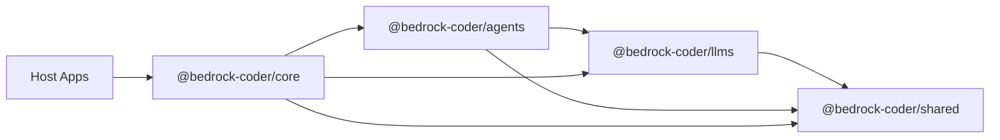

# BedrockCoder SDK Architecture

This document is the architecture source of truth for the BedrockCoder SDK repository. It describes how the system is organized, how components interact, and the design principles that guide development decisions.

**Who should read this?**
- SDK contributors working across multiple packages
- Developers building integrations or host applications using `@bedrock-coder/core`
- Plugin authors understanding the runtime and extension systems

**What this covers:**
- Package boundaries and responsibilities
- Dependency direction and layering rules
- Runtime flows (local and hub-backed)
- Design seams (repeated patterns instead of one-off integrations)
- Architectural constraints and why they exist

**What this is NOT:**
- An onboarding guide for new contributors (see README.md and CONTRIBUTING.md)
- A detailed API reference (see package READMEs and inline JSDoc)
- A user guide (see the main documentation)

## Layered Model

The workspace is organized as a layered runtime stack.

```mermaid
flowchart LR
  shared["@bedrock-coder/shared"]
  llms["@bedrock-coder/llms"]
  agents["@bedrock-coder/agents"]
  core["@bedrock-coder/core"]
  apps["Host Apps"]

  llms --> shared
  agents --> llms
  agents --> shared
  core --> agents
  core --> llms
  core --> shared
  apps --> core
```

## Package Responsibilities

### `@bedrock-coder/shared`

Owns reusable low-level contracts and infrastructure:

- shared types and schemas
- path resolution
- hook contracts/engine
- extension registry contracts
- prompt and parsing helpers
- storage path helpers

Design rule:

- `shared` should not depend on higher-level runtime packages.

### `@bedrock-coder/llms`

Owns model/provider runtime concerns:

- Bedrock connection and model configuration
- Bedrock model construction and streaming
- AI SDK-backed Bedrock execution code

Design rule:

- Bedrock-specific behavior should be isolated here, not spread across `core` or apps.

### `@bedrock-coder/agents`

Owns the stateless runtime loop:

- agent iteration loop
- tool orchestration
- runtime event emission
- hook/extension execution
- turn preparation before provider calls
- in-memory team/runtime primitives

Design rule:

- `agents` should not own persistent storage or host lifecycle concerns.

### `@bedrock-coder/core`

Owns stateful orchestration:

- runtime composition
- session lifecycle
- storage and persistence
- config watching/loading and watcher projections
- Bedrock settings persistence
- default host tool assembly
- plugin discovery/loading
- default context compaction policy
- hub server and scheduled-runtime services under `src/hub/`
- hub discovery, the detached hub daemon, and the `@bedrock-coder/core/hub/daemon-entry` subpath
- host-side hub client adapters (`NodeHubClient`, `HubSessionClient`, `HubUIClient`, `connectToHub`) exported from `@bedrock-coder/core/hub`

Design rules:

- `core` is the app-facing orchestration layer over `agents`.
- hub-related modules live under `packages/core/src/hub/`, grouped by service:
  - `client/` contains host-facing hub clients and browser connection helpers
  - `daemon/` contains detached daemon startup, entrypoint, and local runtime handler wiring
  - `discovery/` contains endpoint defaults, discovery records, and workspace owner resolution
  - `server/` contains WebSocket server startup, native/browser socket adapters, server transport, server helpers, and `handlers/` for hub command dispatch
- Bedrock settings persistence belongs in core storage services, not in
  host-specific provider registries.

## Runtime Flows

### Local In-Process Runtime

1. Host constructs a `RuntimeHost` through `@bedrock-coder/core`.
2. `@bedrock-coder/core` selects `LocalRuntimeHost` through `packages/core/src/runtime/host.ts`.
3. Hosts normalize broad local config into `RuntimeSessionConfig` plus `localRuntime` overrides before calling `RuntimeHost.start(...)`.
4. `@bedrock-coder/core` prepares a local bootstrap artifact from `localRuntime`, then builds the runtime from it.
5. `@bedrock-coder/core` creates an `Agent` from `@bedrock-coder/agents`.
6. `@bedrock-coder/agents` runs the loop using `@bedrock-coder/llms` handlers.
7. `@bedrock-coder/core` persists state, artifacts, and metadata.

Completion telemetry is anchored to the assistant's explicit completion
declaration, not session shutdown. After each agent turn, the local
runtime inspects `AgentResult.toolCalls` and emits `task.completed` the
moment a successful `submit_and_exit` (the SDK analog of original
BedrockCoder's `attempt_completion`) is observed. `shutdownSession(...)`
retains a fallback emission for completed sessions that finished
without an explicit completion-tool observation, so non-interactive
runs not using the yolo preset still produce a `task.completed` signal.
Each session emits at most one `task.completed`. See `DOC.md` for the
event payload and `source` field.

### Local Teams and Task Boards

Local team execution reuses the in-process runtime rather than introducing a
second agent authority:

1. `@bedrock-coder/shared` owns the six-state `TeamTask`, agent, run, board, and
   incremental progress contracts.
2. `DefaultRuntimeBuilder` creates one `AgentTeamsRuntime` per active root
   session and limits concurrent teammate runs with `maxConcurrentTeamRuns`.
3. Teammates inherit the parent's provider/model configuration, tool policies,
   approval callback, and extensions. An assigned worktree must be recognized
   by the parent Git repository before teammate tools are bound to it.
4. The local team store keys state by a hash of the workspace identity plus the
   session/team ID. It writes versioned snapshots atomically and marks active
   runs interrupted during runtime shutdown.
5. Host applications consume `TeamBoardSnapshot` through the optional
   `TeamRuntimeService` methods on the local runtime host. Task revisions provide
   optimistic update checks; the UI does not maintain a second board database.

Worktree creation, merge, and deletion remain host responsibilities because
they require repository-aware validation and explicit UI approval. Core stores
only the validated worktree assignment and uses it as the child tool boundary.

### Hub-Backed Runtime

1. Host constructs a `RuntimeHost` through `@bedrock-coder/core`.
2. `@bedrock-coder/core` selects `HubRuntimeHost` or `RemoteRuntimeHost` through `packages/core/src/runtime/host.ts`.
3. When no compatible local hub is already discovered, `@bedrock-coder/core` can spawn a detached hub daemon and reconnect through discovery.
4. Hosts attach and detach from shared sessions without stopping the authority runtime, so another client can keep streaming or resume the same session later.
5. The hub-hosted runtime executes the agent loop using `@bedrock-coder/agents` and `@bedrock-coder/llms`.
6. `@bedrock-coder/core` hub services broker sessions, events, approvals, schedules, and client-owned runtime capabilities such as session-local tool executors.
7. Hub event forwarding preserves structured streaming lifecycle boundaries: text/reasoning deltas, final text/reasoning completion, tool start/finish, and agent done events are translated across the hub transport so host UIs can reliably close loading/streaming state.
8. Hub client adapters exported from `@bedrock-coder/core/hub` (`NodeHubClient`, `HubSessionClient`, `HubUIClient`, `connectToHub`) translate command/reply and event streams into host-facing APIs.
9. Hub `session.get` records include both canonical root-session usage and explicit aggregate usage from the hub-owned `RuntimeHost`, so attached clients can intentionally render either root-only or root-plus-teammate costs without replaying event streams.

Workspace bootstrap is owned by the runtime that executes the session. Hub
clients preserve an omitted `cwd` and `workspaceRoot` across the transport so
the hub-side execution host can place the session in the shared chat
workspace on its own filesystem at
`<bedrock-coder-data-dir>/workspaces/chat` (by default
`~/.bedrock-coder/data/workspaces/chat`). The chat workspace is seeded with an
`AGENTS.md` rules file that tells the agent to treat the session as a chat
and to create a named project folder only when the user asks for one.
The resolved paths are returned in the session snapshot and are the source of
truth for client-side manifests; transport clients must not invent a local path
for a remote runtime.

Detached daemon startup retries transient `ETXTBSY` spawn failures before
polling discovery. This covers host updates that replace a runtime binary
immediately before the shared hub restarts.

Local hub discovery also carries the authentication contract for the shared
daemon. On startup, the hub server generates a cryptographically random
per-process auth token, stores it in the owner discovery record, and writes that
record with owner-only file permissions. Local clients resolve the token from
the discovery file at connection time rather than embedding it in endpoint URLs.
The server validates the token with a constant-time comparison before accepting
`/hub` WebSocket upgrades or `/shutdown` requests; WebSocket clients send it via
the `Sec-WebSocket-Protocol` header and shutdown requests use an
`Authorization: Bearer` header. Unauthenticated local processes can still probe
public health/build metadata, but they cannot attach to sessions, issue
commands, or stop the daemon.

Local hub rediscovery is limited to managed shared-daemon endpoints obtained
through discovery or `ensure*HubServer(...)` startup paths. Explicit endpoints,
including loopback URLs such as `ws://127.0.0.1:<port>/hub`, are sticky exact
targets: reconnects may retry the same socket URL, but command recovery and
startup-deadlock recovery must not replace them with the workspace-discovered
hub. This keeps custom local hubs and remote hubs from silently drifting to a
different process.

## Design Seams

The codebase relies on a few repeated seams instead of one-off integration paths.

### 1. Config Watchers

Core uses file-based discovery and watchers for:

- rules
- workflows
- skills
- agents
- hooks
- plugins

Design implication:

- new instruction sources should usually materialize into files and reuse watcher-based loading instead of inventing parallel in-memory execution paths.
- in `packages/core`, config-facing discovery, parsing, watching, and slash-command projection live under `src/extensions/config`

### 2. Runtime Builder Inputs

`DefaultRuntimeBuilder` composes a runtime from generic inputs:

- tools
- hooks
- extensions
- user instruction watcher
- telemetry

Design implication:

- higher-level integrations should prefer feeding those seams rather than patching agent internals directly.
- the local runtime bootstrap lives in `packages/core/src/services/local-runtime-bootstrap.ts` and feeds the builder rather than bypassing it

### 3. Runtime Host Boundary

Core exposes one shared execution boundary: `RuntimeHost`.

Concrete implementations:

- `LocalRuntimeHost` for in-process execution
- `HubRuntimeHost` for shared local hub execution
- `RemoteRuntimeHost` for explicit remote hub endpoints

Design implication:

- host selection happens in `packages/core/src/runtime/host.ts`
- `BedrockCoderCore` delegates uniformly to `RuntimeHost` and does not branch on local vs hub behavior
- transport-specific translation belongs inside concrete hosts, not in top-level orchestration
- `RuntimeHost` inputs stay transport-safe, while `BedrockCoderCore.start(...)` is the app-facing facade that normalizes broad local config before delegation
- `RuntimeSessionConfig` is transport-neutral across local, shared hub, and remote hub modes; host-local bootstrap concerns stay under `localRuntime`
- client-local runtime behaviors that must survive hub mode, such as `defaultToolExecutors`, are attached at session start and proxied through hub capability requests instead of changing host selection
- pending prompt list/update/delete are exposed through the grouped
  `BedrockCoderCore.pendingPrompts` service. Usage summary lookup and active-session
  model switching are also service-style capabilities exposed through
  `BedrockCoderCore` when the concrete transport implements them. These service APIs
  are intentionally outside the minimal `RuntimeHost` primitive vocabulary.
- The usage service's `getAccumulatedUsage(sessionId)` method returns a summary
  with two explicit buckets: `usage` for the root/lead agent and
  `aggregateUsage` for root plus teammates/subagents. Local execution tracks
  root usage and teammate usage as separate buckets, then derives aggregate
  totals from those buckets while telemetry remains scoped to the primary
  lead/root agent.

### 4. Settings Mutation Boundary

Core owns settings snapshots and mutations through `packages/core/src/settings`.
The hub exposes the same path through `settings.list` and `settings.toggle`.

Design implication:

- hosts should not mutate skill, tool, MCP, provider, or other settings files directly
- domain-specific persistence helpers, such as skill markdown frontmatter writes, stay internal to the owning settings provider/service
- successful hub-backed mutations return an updated settings snapshot and publish `settings.changed` with the changed settings types
- CLI settings surfaces may keep local snapshot rendering for startup responsiveness, but mutation flow must refresh the relevant watcher before reloading UI data

### 5. Session Startup Bootstrap

`BedrockCoderCore.create(...)` exposes a generic `prepare(input)` hook.

Design implication:

- higher-level packages can prepare workspace-scoped runtime state before a session starts
- core stays unaware of enterprise-specific contracts
- cleanup stays at the host boundary rather than inside the agent loop

### 6. Logging

Cross-package logging uses a small injected interface exported from `@bedrock-coder/shared`:

- **`BasicLogger`** — required `debug` and `log`; optional `error`. Hosts map these to their backend (Pino, VS Code `OutputChannel`, etc.). Many runtime options take `logger?: BasicLogger`; when omitted, components skip logging or use `noopBasicLogger` where a full object is required.
- **`BasicLogMetadata`** — optional structured fields (`sessionId`, `runId`, `providerId`, `toolName`, `durationMs`, …) plus `severity` on `log` when a single method must represent both informational and warning-style messages (for example the CLI Pino bridge maps `severity: "warn"` to Pino `warn`).

Naming clarity:

- **`CliLoggerAdapter` (CLI)** — a **host bundle**: holds the raw `pino` logger (for file paths, rotation, and CLI-only concerns) and exposes `.core: BasicLogger` for anything that consumes the SDK contract. It is not an `ITelemetryAdapter`.
- **`TelemetryLoggerSink` (`@bedrock-coder/core`)** — an **`ITelemetryAdapter`** that mirrors telemetry events and metrics into a `BasicLogger`. It is a telemetry sink, not a host logging implementation.

The agent and other call sites route former `info` / `warn` semantics through `log` (warnings include `severity: "warn"` in metadata). Errors prefer `error` when implemented; otherwise `log` with `severity: "error"` is used as a fallback.

Design implication:

- logging is injectable and transport-agnostic, allowing host environments (CLI, VS Code, browser) to wire their own backends
- do not hardcode logging calls; accept a `logger?: BasicLogger` parameter instead

### 7. Storage Adapters

Stateful persistence should be isolated behind adapter/service layers.

Design implication:

- file-backed, SQLite-backed, RPC-backed, and enterprise-specific persistence should share service logic where possible and isolate backend differences in adapters.

### 8. Extension and Hook System

Extensibility is split deliberately:

- extensions register runtime contributions
- hooks intercept lifecycle stages

Design implication:

- additive runtime behavior should usually enter through these extension points instead of bespoke special-case host code.

### 9. Context Compaction

Context compaction is owned by `core`.

- `@bedrock-coder/agents` owns the generic turn-preparation seam:
  - run normal lifecycle hooks
  - allow hosts to project message history or system prompt before the provider call
  - keep its canonical runtime transcript append-only when a projection is returned
- `@bedrock-coder/core` owns compaction policy:
  - inject a prepare-turn pipeline for root sessions
  - choose between built-in strategies through a registry map
  - persist the latest compacted working context as a session compaction artifact
  - keep compaction logic out of the low-level agent message builder

Design implications:

- compaction is a context-pipeline concern owned by `core`
- canonical session history lives in the session messages artifact at full fidelity; compaction state lives separately in `${sessionId}.compaction.json`
- resume loads the canonical transcript for history/debugging and, when present, reuses the latest compaction state only after validating a hash of the canonical prefix covered by that state; valid state is projected by appending canonical messages written after the compaction boundary
- sessions that were already persisted with compacted messages before this model are best-effort only because the omitted original transcript is not recoverable from the compacted artifact
- `agents` stays focused on the stateless loop and provider/tool orchestration
- delegated/subagent flows should inherit compaction behavior through core session config, not through a separate agent-level compaction hook surface

### 10. Extension Layering Inside Core

`packages/core/src/extensions` is split by concern:

- `extensions/config`: config loaders, parsers, watchers, and watcher projections such as runtime slash-command expansion
- `extensions/plugin`: runtime plugin discovery, loading, and sandboxing
- `extensions/context`: core-owned context/message pipeline concerns such as compaction

Design implications:

- avoid mixing config discovery code into runtime/plugin code
- avoid creating thin runtime wrapper files when a helper is fundamentally projecting watcher state

## Architectural Constraints

### Keep `agents` Stateless

Do not move these concerns into `@bedrock-coder/agents`:

- session persistence
- Bedrock settings storage
- RPC lifecycle
- host-specific approvals
- host account or hosted-policy state

### Keep `core` Host-Neutral

Keep host UI behavior out of `@bedrock-coder/core`. Bedrock is the one inference
backend; host-specific presentation and settings controls remain in the app.

### Use One-Way Optional Layers

Optional higher-level integrations may depend on lower layers.
Lower layers should not depend on optional feature packages.

## File-Based And Event-Driven Automation (`BedrockCoderCore` / `CronService`)

`@bedrock-coder/core` ships a file-based automation subsystem under
`packages/core/src/cron/`. It lets operators author recurring and one-off
tasks as Markdown files under global `~/.bedrock-coder/cron/` by default, and
event-driven tasks as `events/*.event.md` specs. All trigger kinds run
through the same durable queue and runtime handlers. `BedrockCoderCore` exposes the
SDK-facing `bedrockCoder.automation.*` entry points; `CronService` is the internal
orchestrator used by core and hub layers.

### Layers

1. **Spec parser** (`cron/specs/cron-spec-parser.ts`): parses YAML frontmatter + body
   into a `CronSpec` discriminated union (`one_off | schedule | event`).
   Types live in `@bedrock-coder/shared` under `src/cron/cron-spec-types.ts`
   so other packages can consume them without the YAML parser. Schedule
   expressions and timezones are validated before a spec can become
   runnable.
2. **Store** (`cron/store/sqlite-cron-store.ts`): owns `cron.db` at
   `resolveCronDbPath()` (default `.bedrock-coder/data/db/cron.db`). Schema is
   bootstrapped from `cron/store/cron-schema.ts` — sessions and cron live in separate
   DBs so their lifecycles stay decoupled.
3. **Reconciler** (`cron/specs/cron-reconciler.ts`): scans the configured cron specs
   directory (global `~/.bedrock-coder/cron/` by default, or workspace-scoped when
   configured), parses each file independently, and upserts spec state.
   Invalid specs are recorded
   with `parse_status='invalid'` so state is durable rather than silently
   dropped. Files that disappear between scans get `removed=1` and their
   queued runs are cancelled.
4. **Watcher** (`cron/specs/cron-watcher.ts`): `node:fs watch({ recursive: true })`
   with a ~250ms per-path debounce. Watcher events always trigger a
   re-reconcile — the reconciler is always the source of truth, not the
   watcher stream.
5. **Materializer** (`cron/runner/cron-materializer.ts`): turns file-triggered specs into
   queued `cron_runs`. One-off: at most one run record per `(spec_id,
   revision)`, including failed runs so specs do not retry accidentally.
   Schedule: "one overdue catch-up on startup then advance" using
   timezone-aware `getNextCronTime`.
6. **Event ingress** (`cron/events/cron-event-ingress.ts`): accepts already-normalized
   `AutomationEventEnvelope` values, persists them into `cron_event_log`,
   matches enabled event specs by `event_type` plus declarative filters,
   applies dedupe/debounce/cooldown policy, and enqueues `cron_runs` with
   `trigger_kind='event'`. It never executes agents directly. Plugins can
   declare `automationEvents` and submit normalized events through
   `ctx.automation.ingestEvent(...)`; sandboxed plugins forward those events
   through the core plugin event bridge.
7. **Runner** (`cron/runner/cron-runner.ts`): polls `cron.db`, atomically claims
   queued runs, executes them via the existing `HubScheduleRuntimeHandlers`
   (`startSession` → `sendSession` → `stopSession` / `abortSession`),
   renews the run claim while execution is active, writes a markdown report
   per run, and transactionally updates status. File specs can constrain
   tool availability, config extension loading (`rules`, `skills`,
   `plugins`), session source, and a notes directory that is injected into
   the system prompt. Event runs include the normalized trigger event context
   in the prompt.
8. **Reports** (`cron/reports/cron-report-writer.ts`): writes
   `.bedrock-coder/cron/reports/<run-id>.md` with run frontmatter plus
   `## Summary`, `## Usage`, `## Tool Calls`, and, for event runs,
   `## Trigger Event` sections.
9. **Service** (`cron/service/cron-service.ts`): orchestrates all of the above.
   `BedrockCoderCore.create({ automation })` owns the SDK-facing lifecycle and exposes
   `bedrockCoder.automation.*` methods. Hub-side callers can submit normalized events
   through the `cron.event.ingest` command.

The detached hub daemon passes its workspace root as `cronOptions`, so
normal CLI/hub startup watches `${workspaceRoot}/.bedrock-coder/cron/` without a
custom host needing to opt in.

Programmatic hub schedules are stored as `cron_specs` with source
`hub-schedule` and execute through the same `cron_runs`
claim/requeue/report flow as file-backed one-off, recurring, and
event-driven specs. The hub schedule command surface remains a thin adapter;
there is no separate schedules table, schedule store, or schedule runner.

## Navigating the Codebase

### Starting Points by Task

**I want to understand the agent loop and tool execution:**
- Start: `packages/agents/src/agent.ts` — the stateless runtime loop
- Then: `packages/agents/src/agent-step.ts` — individual iteration steps
- Extensions: `packages/core/src/extensions/plugin/` — plugin discovery and sandboxing

**I want to understand session persistence and state:**
- Start: `packages/core/src/runtime/host/local-runtime-host.ts` — local session lifecycle
- Then: `packages/core/src/runtime/orchestration/` — session orchestration
- Settings: `packages/core/src/settings/` — settings mutation and state

**I want to understand the hub system:**
- Start: `packages/core/src/hub/server/` — WebSocket server and hub command handlers
- Clients: `packages/core/src/hub/client/` — host-side hub clients
- Transport: `packages/core/src/hub/runtime-host/` — hub-backed runtime hosts

**I want to add a new tool:**
- Tools registry: `packages/core/src/extensions/tools/` — built-in tool definitions
- Tool execution: `packages/agents/src/tool-use.ts` — how tools are called
- Plugin tools: `packages/core/src/extensions/plugin/` — plugin-registered tools

**I want to understand settings and configuration:**
- Watcher system: `packages/core/src/extensions/config/` — file watching and loading
- Provider config: `packages/core/src/runtime/config/` — provider settings resolution
- Settings services: `packages/core/src/settings/` — settings state and mutation

**I want to add a new runtime feature (hook/extension):**
- Hook contracts: `packages/shared/src/hooks/` — hook types and engine
- Plugin system: `packages/core/src/extensions/plugin/` — plugin discovery and execution
- Runtime builder: `packages/core/src/services/local-runtime-bootstrap.ts` — how runtime is composed

### File Naming Conventions

- `*.ts` — TypeScript source
- `*.test.ts` — unit tests (Vitest)
- `*.e2e.test.ts` — end-to-end tests requiring full integration

### Key Type Locations

- **`BedrockCoderCore`** — `packages/core/src/index.ts` — the main SDK orchestrator
- **`Agent`** — `packages/agents/src/agent.ts` — the agent loop
- **`RuntimeHost`** — `packages/core/src/runtime/host/runtime-host.ts` — execution abstraction
- **`AgentPlugin`** — `packages/shared/src/plugin/` — plugin contract
- **`CronSpec`** — `packages/shared/src/cron/cron-spec-types.ts` — automation specs

## Publishability Constraint

This repo has both publishable SDK packages and internal workspace packages.

Architectural consequence:

- internal packages must not accidentally become part of the publishable SDK surface
- release automation should only target the intended published packages
- internal code may compose with published packages, but published packages should not take hard dependencies on internal-only workspace layers unless you explicitly intend to publish that integration

### Published Packages

The following packages are published to npm:

- `@bedrock-coder/shared` — shared types, contracts, and low-level utilities
- `@bedrock-coder/llms` — provider integrations and model manifests
- `@bedrock-coder/agents` — the agent loop and tool orchestration
- `@bedrock-coder/core` — the main SDK with session management, hub, and configuration

### Internal Apps

The following workspace apps are internal and not published as SDK packages:

- `apps/vscode` — VS Code extension, webview, and testing platform
