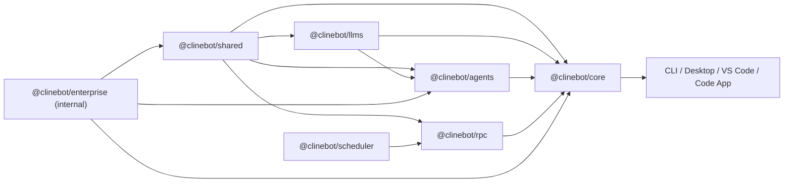

# Cline SDK Packages

This repository contains the packages and host apps that power Cline agent runtimes.

It is a Bun workspace centered around a small stack of reusable packages:

- `@clinebot/shared`: shared contracts, schemas, path helpers, and runtime utilities
- `@clinebot/llms`: model catalogs, provider schemas, and handler creation
- `@clinebot/agents`: stateless agent loop, tools, hooks, and extension primitives
- `@clinebot/scheduler`: scheduled execution and concurrency control
- `@clinebot/rpc`: cross-process runtime gateway
- `@clinebot/core`: stateful orchestration, sessions, storage, and runtime assembly
- `@clinebot/enterprise`: used for internal enterprise integrations. It is intentionally excluded from the root SDK build/version/publish flows.

Host apps in `apps/` compose those packages into real user-facing products such as the CLI, desktop apps, and the VS Code extension.

## What This Repo Is

This repo is the implementation workspace for the next-generation Cline SDK.

If you are visiting to understand the project at a high level:

- `README.md`: visitor-facing overview of the repository
- [ARCHITECTURE.md](./ARCHITECTURE.md): system design, dependency direction, and runtime flows
- [DOC.md](./DOC.md): detailed API and behavior reference
- [AGENTS.md](./AGENTS.md): contributor onboarding and codebase navigation

## Resources

Use the docs by question type:

- Start with `README.md` if you want a high-level introduction to what this repository is and what lives here.
- Read [AGENTS.md](./AGENTS.md) if you are a developer onboarding into the codebase and need workflow, ownership, and change-routing guidance.
- Read [ARCHITECTURE.md](./ARCHITECTURE.md) if you want to understand the design of the system, package boundaries, and runtime flows.
- Read [DOC.md](./DOC.md) if you need detailed package/API/behavior reference while implementing or debugging something.

## Workspace Overview

### Packages

- `packages/shared`: cross-package building blocks
- `packages/llms`: provider/model runtime layer
- `packages/agents`: stateless execution layer
- `packages/scheduler`: scheduled runtime execution
- `packages/rpc`: transport and control-plane layer
- `packages/core`: stateful orchestration layer
- `packages/enterprise`: internal enterprise bridge

### Apps

- `apps/cli`: command-line host
- `apps/code`: Tauri + Next.js desktop app
- `apps/desktop`: Tauri desktop app with board-oriented UX
- `apps/vscode`: VS Code extension
- `apps/examples`: sample integrations and usage examples

## Quick Look

## Getting Around

If you want to:

- understand the design: start with [ARCHITECTURE.md](./ARCHITECTURE.md)
- inspect APIs and behaviors: use [DOC.md](./DOC.md)
- work on the codebase as a contributor: read [AGENTS.md](./AGENTS.md)
- see how the SDK is consumed: look at `apps/cli`, `apps/code`, `apps/desktop`, and `apps/examples`

## Development Entry Points

Common root commands:

- `bun run build`
- `bun run build:sdk`
- `bun run build:apps`
- `bun run test`
- `bun run types`
- `bun run check`

Root SDK build/version/publish automation only includes the publishable SDK packages. Internal-only workspace packages such as `packages/enterprise` are worked on directly when needed.
