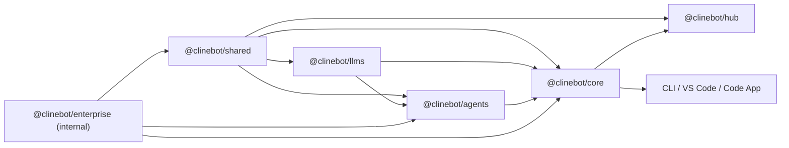

# Cline SDK Packages

_CONFIDENTIAL AND PROPRIETARY_

This repository contains the packages and host apps that power Cline agent runtimes.

It is a Bun workspace centered around a small stack of reusable packages:

- `@clinebot/shared`: shared contracts, schemas, path helpers, and runtime utilities
- `@clinebot/llms`: model catalogs, shared provider contracts, and AI SDK-backed handler creation
- `@clinebot/agents`: stateless agent loop, tools, hooks, and extension primitives
- `@clinebot/hub`: hub discovery, hub clients, and host-side daemon helpers
- `@clinebot/core`: stateful orchestration, sessions, storage, and runtime assembly
- `@clinebot/enterprise`: used for internal enterprise integrations. It is intentionally excluded from the root SDK build/version/publish flows.

Host apps in `apps/` compose those packages into real user-facing products such as the CLI apps, and the VS Code extension.

## Documentation Guide

This repo is the implementation workspace for the next-generation Cline SDK.

Choose documentation by your question:

- **Getting started**: [CONTRIBUTING.md](./CONTRIBUTING.md) covers workspace setup, development workflow, debugging, and publishing
- **Active development**: [AGENTS.md](./AGENTS.md) for package boundaries, dependency rules, change routing, and verification
- **System design**: [ARCHITECTURE.md](./ARCHITECTURE.md) for design decisions and runtime flows
- **API reference**: [DOC.md](./DOC.md) for detailed package/behavior specifications

## Workspace Structure

### Apps

- `apps/cli`: command-line interface
- `apps/vscode`: VS Code extension
- `apps/examples`: sample integrations and usage examples

## Quick Look

## Development Entry Points

Common root commands:

- `bun run build`
- `bun run build:sdk`
- `bun run build:apps`
- `bun run test`
- `bun run types`
- `bun run check`

Root SDK build/version/publish automation only includes the publishable SDK packages. Internal-only workspace packages such as `packages/enterprise` are worked on directly when needed.
