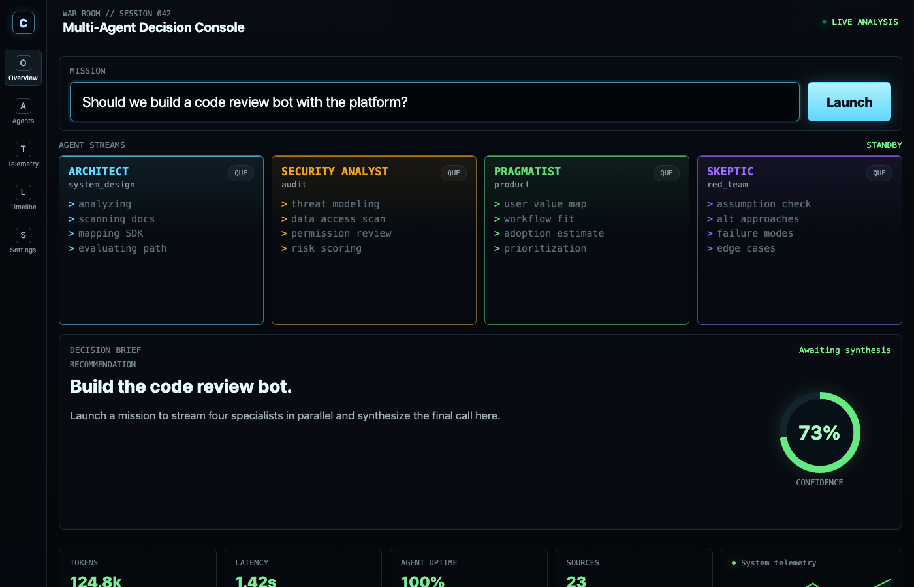

# Multi-Agent War Room

A web app that spawns four specialist agents in parallel, streams their responses to the browser in real time via SSE, then feeds their findings into a synthesizer agent that produces a unified decision brief.



## Getting started

Install dependencies:

```bash
bun install
bun run build:sdk
```

Set an API key:

```bash
export CLINE_API_KEY="sk_..."
```

Run:

```bash
bun dev
```

Open http://localhost:3456 in your browser, enter a mission, and watch the agents work.

## What it does

1. You enter a mission in the browser
2. The server spawns four `Agent` instances in parallel via `Promise.all`:
   - Architect (system design)
   - Security Analyst (audit)
   - Pragmatist (product)
   - Skeptic (red team)
3. Each agent streams `assistant-text-delta` events to the browser via SSE, rendered in its own card
4. Once all specialists finish, a synthesizer agent combines their findings into a unified decision brief, also streamed live

## Concepts demonstrated

- Running multiple `Agent` instances concurrently with `Promise.all`
- Per-agent `subscribe()` for independent event streams
- Server-Sent Events (SSE) to stream agent output to a browser
- Agent composition: feeding one agent's output as input to another
- Inline HTML frontend served from the same Node.js server (single file, no build step)

## Notes

For a simpler starting point, see [quickstart](../quickstart). For custom tools and structured workflows, see [code-review-bot](../code-review-bot).
