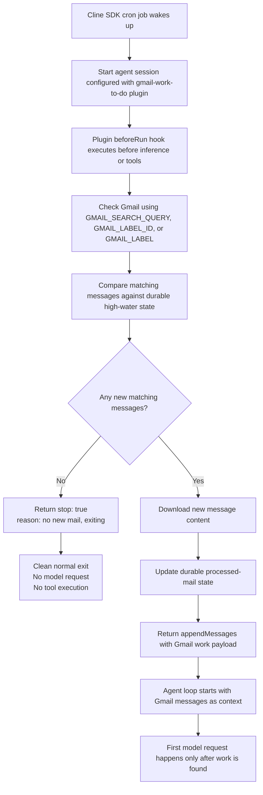

# Gmail Work-to-Do Gate Plugin

Example package plugin that uses the SDK `beforeRun` pre-inference hook to wake cheaply, check Gmail, and only let the agent start when matching mail is new to the plugin.

If no new matching mail exists, the hook returns:

```ts
{ stop: true, reason: "no new mail, exiting" }
```

That exits the run normally before any model request or tool execution.

## Install / load

From this repository:

```bash
cline plugin install ./sdk/examples/plugins/gmail-work-to-do --cwd /path/to/workspace
```

Or pass it directly to `ClineCore` with `pluginPaths`.

## Cron-gated run flow



## Required environment variables

### Search or label

- `GMAIL_SEARCH_QUERY` — Gmail search query passed to `users.messages.list`, for example:
  - `label:inbox newer_than:1d from:alerts@example.com`
  - `to:me subject:(Action Required)`
  - `label:work -label:processed`
- `GMAIL_LABEL_ID` — Gmail label ID to list directly, for example `INBOX`, `Label_123456789`, or another ID from Gmail's labels API.
- `GMAIL_LABEL` — Gmail label display name to resolve through the labels API, for example `Work/To Do`.

Set **one** of `GMAIL_SEARCH_QUERY`, `GMAIL_LABEL_ID`, or `GMAIL_LABEL`. If multiple are set, `GMAIL_SEARCH_QUERY` takes precedence, then `GMAIL_LABEL_ID`, then `GMAIL_LABEL`.

Optional:

- `GMAIL_MAX_RESULTS` — maximum Gmail search results to inspect per wake-up. Default `25`, max `100`.
- `GMAIL_WORK_STATE_PATH` — override the durable state file path. By default, state is stored under `${CLINE_DATA_DIR:-~/.cline/data}/plugins/gmail-work-to-do/state.json`.

### OAuth

Use a Google OAuth token with Gmail read-only access. The plugin requests data with the Gmail API; it does not hardcode secrets.

For short-lived local tests, you can provide a simple access token:

- `GMAIL_ACCESS_TOKEN` — OAuth access token with Gmail read scope. Google access tokens usually expire in about one hour, so this is convenient for manual tests but less suitable for unattended cron unless another process refreshes it.

#### Creating a throwaway access token with OAuth 2.0 Playground

For quick local testing, you can create a short-lived token with Google's OAuth 2.0 Playground:

1. Go to <https://developers.google.com/oauthplayground>.
2. In the **Input your own scopes** box on the left, paste:

   ```txt
   https://www.googleapis.com/auth/gmail.readonly
   ```

3. Click **Authorize APIs**.
4. Sign in with the Gmail account whose mail you want to read and grant consent.
5. Click **Exchange authorization code for tokens**.
6. Copy the generated access token and export it:

   ```bash
   export GMAIL_ACCESS_TOKEN="ya29.your_access_token_here"
   ```

The access token is short-lived, typically about one hour. The Playground also shows a refresh token; use refresh-token OAuth config for unattended cron runs.

Or provide an access token in `GMAIL_TOKEN_PATH`:

```json
{
  "access_token": "ya29.example_access_token",
  "scope": "https://www.googleapis.com/auth/gmail.readonly",
  "token_type": "Bearer"
}
```

For cron-friendly automatic refresh, provide direct refresh-token OAuth variables:

- `GMAIL_CLIENT_ID`
- `GMAIL_CLIENT_SECRET`
- `GMAIL_REFRESH_TOKEN`
- `GMAIL_REDIRECT_URI` optional, depending on your OAuth client

Or provide files exported from a standard OAuth setup. If `GMAIL_TOKEN_PATH` contains `refresh_token`, the plugin uses it for automatic refresh; if it contains only `access_token`, the plugin uses that short-lived token directly:

- `GMAIL_CREDENTIALS_PATH` — JSON credentials file from Google Cloud Console (`installed` or `web` client shape)
- `GMAIL_TOKEN_PATH` — JSON token file containing `access_token` or `refresh_token`

The OAuth token must have a scope that can read messages, such as:

```txt
https://www.googleapis.com/auth/gmail.readonly
```

## How new-vs-processed tracking works

The plugin does **not** rely on the mutable Gmail `UNREAD` label. Instead it stores durable per-plugin state:

```json
{
  "maxInternalDate": "1760000000000",
  "seenIdsAtMaxInternalDate": ["message-id-at-boundary"]
}
```

Gmail message `id` and `internalDate` are stable. The high-water mark is the largest `internalDate` processed so far. Because multiple messages can share the same `internalDate`, the plugin also stores the set of message IDs already seen at that timestamp boundary.

On each wake-up:

1. Search Gmail with `GMAIL_SEARCH_QUERY`, or list messages for `GMAIL_LABEL_ID` / `GMAIL_LABEL`.
2. Fetch full content for matching messages.
3. Select messages with `internalDate` greater than the high-water mark, plus unseen IDs at the exact boundary timestamp.
4. If none are new, log `no new mail, exiting` and abort normally before inference.
5. If any are new, update the durable state and hand the messages to the agent as a pre-run user message.

## Error behavior

- Empty search result or all results already processed: normal abort, not an error.
- Missing OAuth configuration: error.
- Gmail API/auth failures: error.

## Tests

```bash
bun -F @cline/example-plugin-gmail-work-to-do test
```

The tests cover high-water dedupe, same-timestamp boundary handling, no-new-mail abort, and handoff when new mail exists.