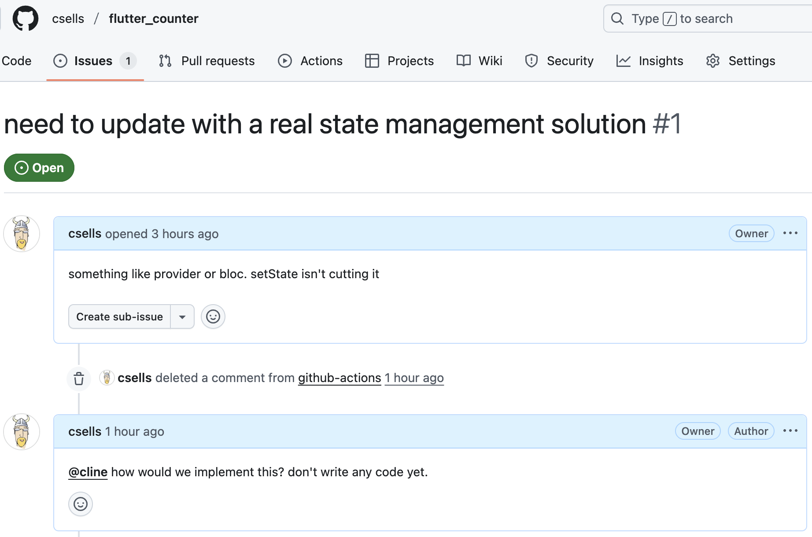
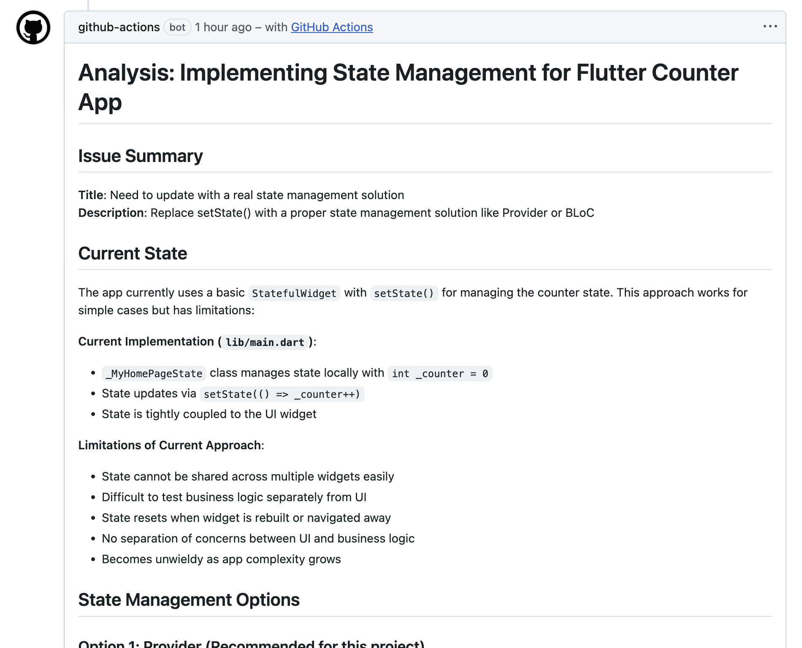
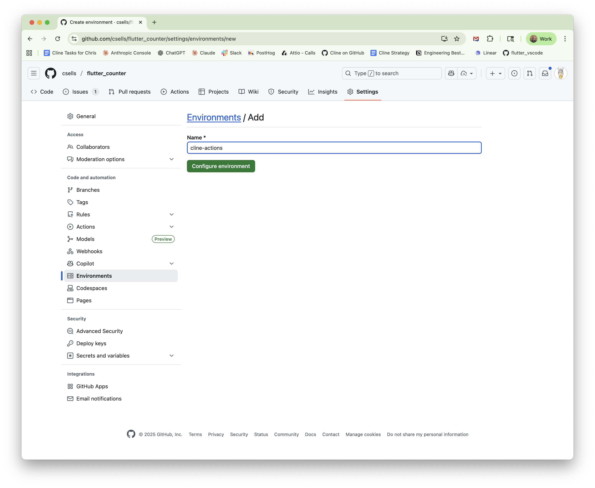
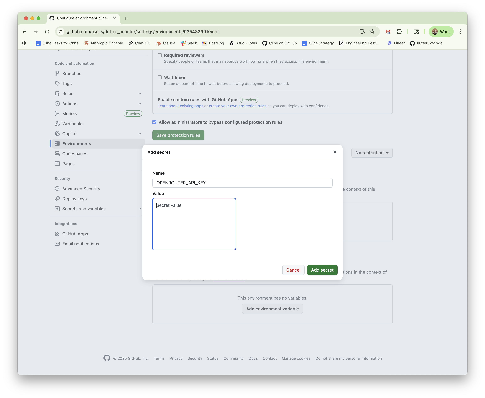
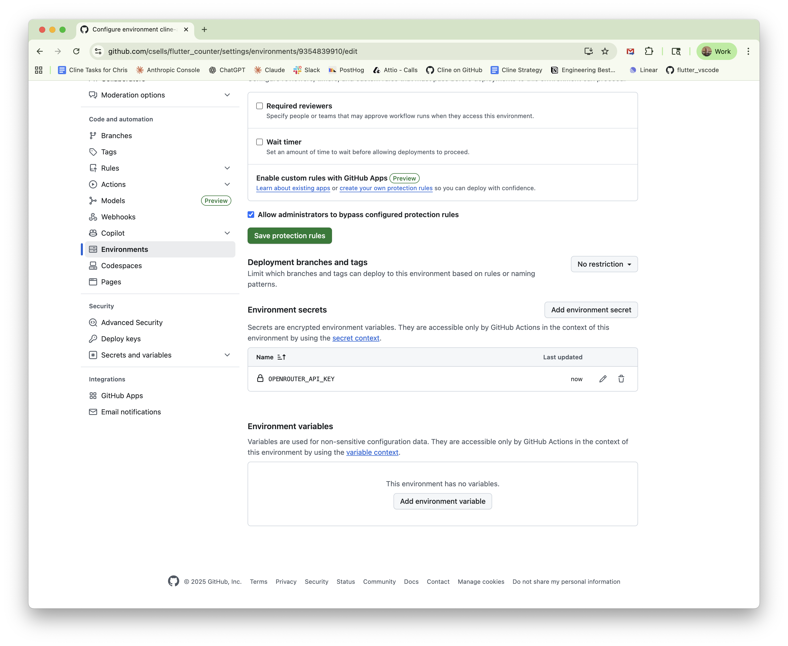

# GitHub Integration Sample

Automatically respond to GitHub issues by mentioning `@cline` in comments using
Cline CLI in GitHub Actions.

> [!NOTE]
> **New to Cline CLI?** This sample assumes you understand Cline CLI basics and have completed the [Installation Guide](https://docs.cline.bot/cline-cli/installation). If you're new to Cline CLI, we recommend starting with the [GitHub RCA sample](../github-issue-rca) first, as it's simpler and will help you understand the fundamentals before setting up GitHub Actions.

The goal is to go from a comment on an issue like this:



And ask Cline to provide his thoughts like this:



Let's get this set up!

## Prerequisites

This sample assumes you have:

- **Cline CLI knowledge** - Completed the [Installation Guide](https://docs.cline.bot/cline-cli/installation) and understand basic usage
- **GitHub repository** - With admin access to configure Actions and secrets
- **GitHub Actions familiarity** - Basic understanding of workflows and CI/CD
- **API provider account** - OpenRouter, Anthropic, or similar with API key

## Setup

### 1. Copy the Workflow File

Copy the workflow file from this sample to your repository:

```bash
# In your repository root
mkdir -p .github/workflows
curl -o .github/workflows/cline-responder.yml https://raw.githubusercontent.com/cline/cline/main/src/samples/cli/github-integration/cline-responder.yml
```

> [!IMPORTANT]
> **You MUST edit the workflow file before committing!**
> 
> Open `.github/workflows/cline-responder.yml` and update the "Download analyze script" step:
> 
> ```yaml
> export GITORG="YOUR-GITHUB-ORG"      # Change this!
> export GITREPO="YOUR-GITHUB-REPO"    # Change this!
> ```
> 
> **Example:** If your repository is `github.com/acme/myproject`, set:
> ```yaml
> export GITORG="acme"
> export GITREPO="myproject"
> ```
> 
> This tells the workflow where to download the analysis script from your repository after you commit it in step 3.

The workflow will look for new or updated issues, check for `@cline` mentions, and then
start up an instance of the Cline CLI to dig into the issue, providing feedback
as a reply to the issue.

**Note**: The workflow file **must** be placed in `.github/workflows/`
directory in your repository root for GitHub Actions to detect and run it.

### 2. Configure API Keys

Add your AI provider API keys as repository secrets:

1. Go to your GitHub repository
2. Navigate to **Settings** → **Environment** and Add a new environment.

   

   Make sure to name it "cline-actions" so that it matches the `environment`
   value at the top of the `cline-responder.yml` file.

3. Click **New repository secret**
4. Add a secret for the `OPENROUTER_API_KEY` with a value of an API key from
   [openrouter.com](https://openrouter.com).

   

5. Verify your secret is configured:

   

Now you're ready to supply Cline with the credentials it needs in a github
action.

### 3. Add Analysis Script

Add the analysis script from the `github-issue-rca` sample to your repository. Choose one of these options:

**Option A: Download directly (Recommended)**

```bash
# In your repository root
mkdir -p git-scripts
curl -o git-scripts/analyze-issue.sh https://raw.githubusercontent.com/cline/cline/main/src/samples/cli/github-issue-rca/analyze-issue.sh
chmod +x git-scripts/analyze-issue.sh
```

**Option B: Copy from local Cline repository**

If you have the Cline repository cloned locally:

```bash
# In your repository root
mkdir -p git-scripts
cp /path/to/cline/src/samples/cli/github-issue-rca/analyze-issue.sh git-scripts/
chmod +x git-scripts/analyze-issue.sh
```

This analysis script calls Cline to execute a prompt on a GitHub issue,
summarizing the output to populate the reply to the issue.

### 4. Commit and Push

```bash
git add .github/workflows/cline-responder.yml
git add git-scripts/analyze-issue.sh
git commit -m "Add Cline issue assistant workflow"
git push
```

## Usage

Once set up, simply mention `@cline` in any issue comment:

```
@cline what's causing this error?

@cline analyze the root cause

@cline what are the security implications?
```

GitHub Actions will:
1. Detect the `@cline` mention
2. Start a Cline CLI instance
3. Download the analysis script
4. Analyze the issue using act mode with yolo (fully autonomous)
5. Post Cline's analysis as a new comment

**Note**: The workflow only triggers on issue comments, not pull request
comments.

## How It Works

The workflow (`cline-responder.yml`):

1. **Triggers** on issue comments (created or edited)
2. **Detects** `@cline` mentions (case-insensitive)
3. **Installs** Cline CLI globally using npm
4. **Creates** a Cline instance using `cline instance new`
5. **Configures** authentication using `cline config set open-router-api-key=...
   --address ...`
6. **Downloads** the reusable `analyze-issue.sh` script from the
   `github-issue-rca` sample
7. **Runs** analysis with the instance address
8. **Posts** the analysis result as a comment

### Command Used

The workflow uses the script from the **github-issue-rca** sample, which
internally runs:

```bash
cline -y "$PROMPT: $ISSUE_URL" --mode act --address "$CLINE_ADDRESS" -F json
```

**Flags:**
- `-y` / `--yolo` - Yolo mode (non-interactive,
  auto-approves all actions)
- `--mode act` - Uses Act mode to actively investigate (reads files, runs
  commands, etc.)
- `--address` - Specifies which Cline instance to use
- `-F json` - JSON output format for parsing

## Related Samples

- **[github-issue-rca](../github-issue-rca)**: The reusable script that powers this integration
