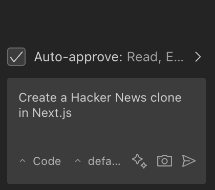
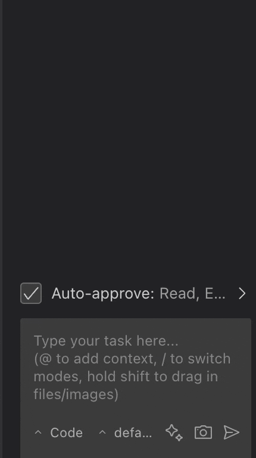

# Code mode

Describe what you want to build in the text area and press ⮐ Enter.

The more context you give, the better the result. Include things like your tech stack, key features, or file names.

_Example: Create a Hacker News clone in Next.js_

Cline, generate the files, and run the project for you.

## Cline has many Modes ...

