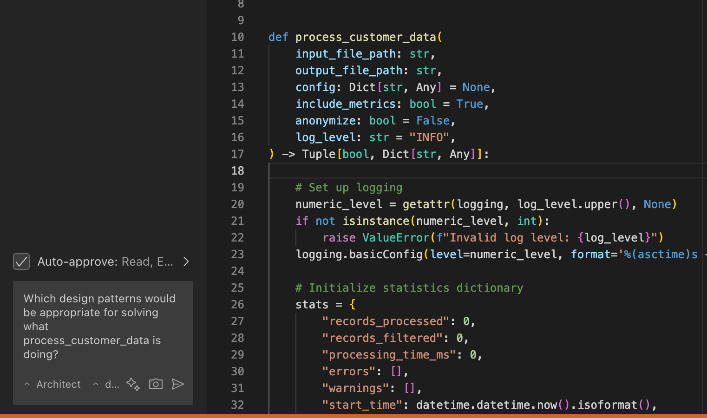

# Architect mode

Need to plan before writing code? Switch to Architect mode and ask high-level questions about structure, patterns, or logic.

Use it to break down features, map out components, or design how everything should work before diving in.
